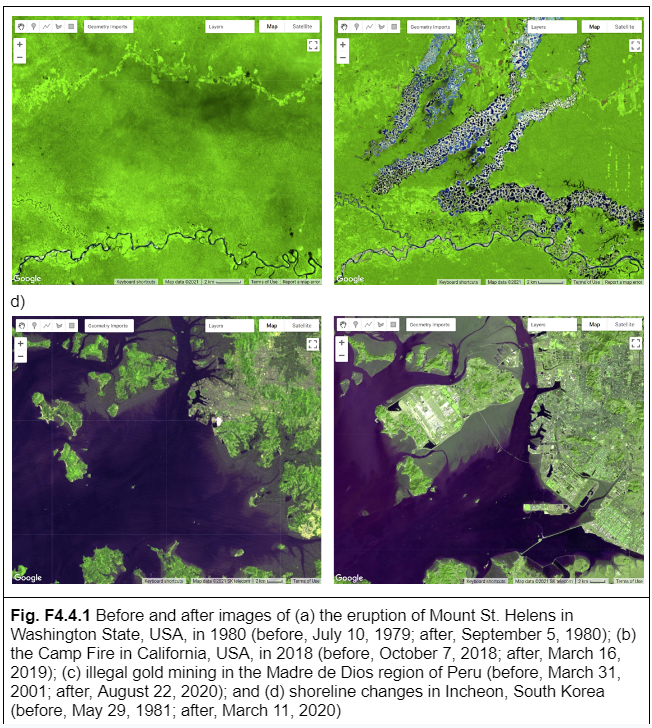

# Introduction

Welcome to Two Date Change Detection! This workshop contains multiple hands on Google Earth Engine case studies. We will focus on water change detection leveraging Landsat optical data. 

*Content for this workshop was adapted from [EEFA Book Chapter F4.4](https://www.eefabook.org/table-of-contents.html)*

## Pre-workshop Set-up
1. Ensure you are logged into your Google Earth Engine account.
2. Click this link to accept the trinidad-tobago GEE script repository - https://code.earthengine.google.com/?accept_repo=users/kwoodward/trinidad-tobago

## Objectives
1. Calculating spectral indices to extract patterns
2. Creating a two-image difference to help locate areas of change
3. Producing a change map and classifying changes using thresholding

**Introduction to Theory**

Change detection is the process of assessing how landscape conditions are changing by looking at differences in images acquired at different times. This can be used to quantify changes in forest cover—such as those following a volcanic eruption, logging activity, or wildfire—or when crops are harvested (Fig. F4.4.1). For example, using time-series change detection methods, Hansen et al. (2013) quantified annual changes in forest loss and regrowth. Change detection mapping is important for observing, monitoring, and quantifying changes in landscapes over time. Key questions that can be answered using these techniques include identifying whether a change has occurred, measuring the area or the spatial extent of the region undergoing change, characterizing the nature of the change, and measuring the pattern (configuration or composition) of the change (MacLeod and Congalton 1998).

Many change detection techniques use the same basic premise: that most changes on the landscape result in spectral values that differ between pre-event and post-event images. The challenge can be to separate the real changes of interest—those due to activities on the landscape—from noise in the spectral signal, which can be caused by seasonal variation and phenology, image misregistration, clouds and shadows, radiometric inconsistencies, variability in illumination (e.g., sun angle, sensor position), and atmospheric effects.

Activities that result in pronounced changes in radiance values for a sufficiently long time period are easier to detect using remote sensing change detection techniques than are subtle or short-lived changes in landscape conditions. Mapping challenges can arise if the change event is short-lived, as these are difficult to capture using satellite instruments that only observe a location every several days. Other types of changes occur so slowly or are so vast that they are not easily detected until they are observed using satellite images gathered over a sufficiently long interval of time. Subtle changes that occur slowly on the landscape may be better suited to more computationally demanding methods, such as time-series analysis. Kennedy et al. (2009) provides a nice overview of the concepts and tradeoffs involved when designing landscape monitoring approaches. Additional summaries of change detection methods and recent advances include Singh (1989), Coppin et al. (2004), Lu et al. (2004), and Woodcock et al. (2020). 

For land cover changes that occur abruptly over large areas on the landscape and are long-lived, a simple two-date image differencing approach is suitable. Two-date image differencing techniques are long-established methods for identifying changes that produce easily interpretable results (Singh 1989). The process typically involves four steps: (1) image selection and preprocessing; (2) data transformation, such as calculating the difference between indices of interest (e.g., the Normalized Difference Vegetation Index (NDVI)) in the pre-event and post-event images; (3) classifying the differenced image(s) using thresholding or supervised classification techniques; and (4) evaluation. 

**References**

Cohen WB, Healey SP, Yang Z, et al (2017) How similar are forest disturbance maps derived from different Landsat time series algorithms? Forests 8:98. https://doi.org/10.3390/f8040098

Coppin P, Jonckheere I, Nackaerts K, et al (2004) Digital change detection methods in ecosystem monitoring: A review. Int J Remote Sens 25:1565–1596. https://doi.org/10.1080/0143116031000101675

Crameri F, Shephard GE, Heron PJ (2020) The misuse of colour in science communication. Nat Commun 11:1–10. https://doi.org/10.1038/s41467-020-19160-7

Fung T (1990) An assessment of TM imagery for land-cover change detection. IEEE Trans Geosci Remote Sens 28:681–684. https://doi.org/10.1109/TGRS.1990.572980

Hansen MC, Potapov PV, Moore R, et al (2013) High-resolution global maps of 21st-century forest cover change. Science 342:850–853. https://doi.org/10.1126/science.1244693

Kennedy RE, Townsend PA, Gross JE, et al (2009) Remote sensing change detection tools for natural resource managers: Understanding concepts and tradeoffs in the design of landscape monitoring projects. Remote Sens Environ 113:1382–1396. https://doi.org/10.1016/j.rse.2008.07.018

Lu D, Mausel P, Brondízio E, Moran E (2004) Change detection techniques. Int J Remote Sens 25:2365–2401. https://doi.org/10.1080/0143116031000139863

Macleod RD, Congalton RG (1998) A quantitative comparison of change-detection algorithms for monitoring eelgrass from remotely sensed data. Photogramm Eng Remote Sensing 64:207–216

Singh A (1989) Digital change detection techniques using remotely-sensed data. Int J  Remote Sens 10:989–1003. https://doi.org/10.1080/01431168908903939

Stehman SV, Czaplewski RL (1998) Design and analysis for thematic map accuracy assessment: Fundamental principles. Remote Sens Environ 64:331–344. https://doi.org/10.1016/S0034-4257(98)00010-8

Woodcock CE, Loveland TR, Herold M, Bauer ME (2020) Transitioning from change detection to monitoring with remote sensing: A paradigm shift. Remote Sens Environ 238:111558. https://doi.org/10.1016/j.rse.2019.111558
