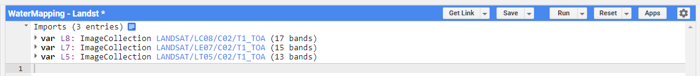

# Overview

In this case study you will develop a tool that maps areas inundated by water for different years based on Landsat 5, 7 and 8.

 This training session was adapted from [SERVIR Mekong Case Study 2 - Surface Water Mapping](https://docs.google.com/document/d/1uyFCMNi1mhiMvwEwFiqOflyUL__uKb7jwwsSLES3hQo/edit)

## Theory

High-resolution measurements of the distribution and dynamics of surface water are essential for many environmental applications, such as flood forecasting and warning, agricultural and urban water management and simulation of transport of pollutants in water bodies. Water can be detected using multi-spectral satellite imagery, as water significantly absorbs most radiation at near-infrared (NIR) wavelengths and beyond. The Normalized Difference Water Index (NDWI) is a simple spectral index that uses the strong absorption of water in NIR to identify water bodies. 

**Import Landsat Data**

First, create a new script in your script repository, name it 'WaterMapping-Landsat'. 

Open the script and lets import Landsat 5, 7, and 8 Top of Atmosphere (TOA) reflectance `ImageCollections`. In the **Search** bar at the top, type 'Landsat TOA', you will find multiple datasets. 


Click on 'USGS Landsat 8 Collection 2 Tier 1 TOA Reflectance' and in the pop-up dialog box click 'Import'


Name the imported `ImageCollection` 'l8'. Now do the same for Landsat 7 TOA, and Landsat 5 TOA `ImageCollections`, naming them 'l7' and 'l5' respectively.



In your script, set the start and end dates that we will be filtering the `ImageCollections` on.

```javascript
// start and end date for filter
var startdate = ee.Date('2015-01-01');
var enddate = ee.Date('2016-12-31');
```

We only want to focus on our country. Therefore we use the 'ADM0_NAME' property to filter the FAO GAUL Administrative Boundary `FeatureCollection` dataset. 

```javascript
// Derive an Area of Interest 
var countryName = 'Trinidad and Tobago';

var countries = ee.FeatureCollection("FAO/GAUL/2015/level0");
var aoi = countries.filter(
  ee.Filter.eq('ADM0_NAME', countryName));

Map.addLayer(aoi,{},'AOI');
```

Select Landsat 8 images within the specified time range and region. Print the size of the resulting filtered `ImageCollection`

```javascript
// filter L8 image collection
var l8images = L8.filterDate(startdate, enddate)
    .filterBounds(aoi);
    
print('Number of Landsat 8 images from filter',l8images.size());    
```

Make a function to mask the clouds (adjust the threshold if necessary). 

```javascript
// cloud score threshold
var cloudThresh = 20;

// mask cloud function
var cloudFunction = function(image){
  var score = ee.Algorithms.Landsat.simpleCloudScore(image).select('cloud');
  var cloudy = score.gt(cloudThresh);
  var cloudmask = cloudy.not();
  return image.updateMask(cloudmask);
};
```
Optionally, lets figure out what the function is doing by applying the function's logic to the first image in the Landsat 8 collection. Paste this code block into your script, un-comment the lines, and hit **Run**. 

```javascript
// how does the function work? 
// // compute the function for the first image outside of function definition
// Map.addLayer(l8images.first(),{},'l8images.first()');
// var score = ee.Algorithms.Landsat.simpleCloudScore(l8images.first()).select('cloud');
// var cloudy = score.gt(cloudThresh);
// var cloudmask = cloudy.not();
// var output = l8images.first().updateMask(cloudmask);
// Map.addLayer(score,{},'score');
// Map.addLayer(cloudy,{},'cloudy');
// Map.addLayer(cloudmask,{},'cloudmask');
// Map.addLayer(output,{
//     min: 0, 
//     max: 0.5,
//     bands: ['B4', 'B3', 'B2'] // what bands should you use for true color?
//   }, 'output');
```
Comment-out the above code block again to remove it from your analysis.

Now, map the cloud masking function over the Landsat 8 collection. 

```javascript
//.map() applies function to every image in collection
var l8CloudMasked = l8images.map(cloudFunction);
```

Display the median of the image collection for your region for Landsat 8. What bands should you use to display the image as a true color image?

```javascript
// center map over aoi at zoom scale, add cloud masked composite to map
Map.centerObject(aoi, 9);
Map.addLayer(l8CloudMasked.median().clip(aoi), {
    min: 0, 
    max: 0.3,
    bands: ['', '', '']
  }, 'Landsat 8 True color');
```

Lookup the band designations of Landsat 8. Use the **Search** bar at the top like before to lookup each collection. Alternatively, if the given dataset is already imported you can  click on your imports at the top of your script (see Figure 3 above).

Now we are going to calculate the Normalized Difference Water Index (NDWI) using the Landsat 8 images.  NDWI can be used to identify areas covered with water and is given by:


We make a function that calculates the NDWI for each image in a collection.  The function needs the Green and NIR bands from the equation above to be named 'green' and 'nir'.  NDWI is added as a band to each image.

```javascript
// function NDWI calculation
function addNdwi(img) {
  var ndwi = img.normalizedDifference(['green', 'nir']).rename('NDWI');
  return img.addBands(ndwi);
}
```
The next step is to run the function for each image in the Landsat 8 collection. First, rename the bands as appropriate, then use the map statement:

```javascript
// select and rename bands, then map the NDWI function to every image
var bands = ['green', 'nir'];

var l8ndwi = l8CloudMasked
    .select(['B3', 'B5'], bands)
    .map(addNdwi);
```
Print the first image of the `l8ndwi` collection. Verify that the band NDWI has been added 

```javascript
print(l8ndwi.first());
```

Now we are going to visualize the results for Landsat 8 by taking the maximum value of the image collection.

```javascript
var ndwiViz = {bands: 'NDWI', min: 0.0, max: 0.3, palette: '0000FF'};

// max composite of NDWI bands for every image in collection
var ndwimax = l8ndwi.select('NDWI').max();

Map.addLayer(ndwimax.mask(ndwimax), ndwiViz, 'NDWI');
```


What happens you use replace `.max()` with `.mean()`? Try it on a new line - make a `ndwimean` variable and also add it to the map.

What is the purpose of `ndwimax.selfMask()`?

Zoom into an area you are familiar with. Click the **Inspector** tab then click on the map with your cursor. What is the mean NDWI there? What is the max?


Code Checkpoint: [https://code.earthengine.google.com/5a541d54b3b1a0310bd061e874dee6d3](https://code.earthengine.google.com/5a541d54b3b1a0310bd061e874dee6d3)

Next we will calculate the NDWI for Landsat 5 and Landsat 7. Please note that the bands designations are different.  Open the Data Catalog information on Landsat 5 and Landsat 7 to see which bands correspond to Green and NIR wavelengths. Remember, you can click on your script's imported datasets at the top to open the Data Catalog information. 

In the next step, we will do the filtering, cloud masking, band selection and NDWI computation all at once to the Landsat 5 and Landsat 7 collections.  (The date cutoffs are arbitrary.)

```javascript
// preprocess Landsat5 and Landsat7 the same way as Landsat8
var l5ndwi = l5
  .filterBounds(aoi)
  .filterDate('1984-01-01', '1998-12-31')
  .map(cloudFunction)
  .select(['B2', 'B4'], bands)
  .map(addNdwi);

var l7ndwi = l7
  .filterBounds(aoi)
  .filterDate('1999-01-01', '2012-12-31')
  .select(['B2', 'B4'], bands)
  .map(addNdwi);
```

Since the bands are now homogeneous between the three Landsat `ImageCollections`, we can merge them.

```javascript
// Merge all 3 Landsat missions together
var collection = ee.ImageCollection(
  l5ndwi.merge(l7ndwi).merge(l8ndwi));
```

You can now make a water layer for any year in the merged collection by filtering it to the desired date range.  For example:

```js
var year = 2000;

var ndwi2000 = collection.filterDate({
  start: ee.Date.fromYMD(year, 1, 1),
  end: ee.Date.fromYMD(year, 12, 31)
}).max();

Map.addLayer(ndwi2000.selfMask(), ndwiViz, '2000 NDWI');
```
You can also compute things like frequency of inundation (the zero threshold is arbitrary). Uncomment commented out code to better understand what the `frequency` is doing with `waterBinary`

```js
var waterBinary = collection.select('NDWI').map(function(image) {
  return image.gt(0);
});

// // Add waterBinary to map to look at the series
// Map.addLayer(waterBinary,{},'waterBinary')

var frequency = waterBinary.sum().divide(waterBinary.count());
Map.addLayer(frequency.selfMask(), 
  {palette: ['white', 'magenta', 'blue']}, 'inundation frequency');
```


Code Checkpoint: [https://code.earthengine.google.com/df9073ffcfa8e059a5a4ac196b83e055](https://code.earthengine.google.com/df9073ffcfa8e059a5a4ac196b83e055)

Challenge 1: modify the start and end parameters to map surface water detected in one season of the year over several years. 

Challenge 2: The sentinel-2 satellite has a higher spatial resolution than the Landsat satellites. Calculate the NDWI for a sentinel-2 image. 

