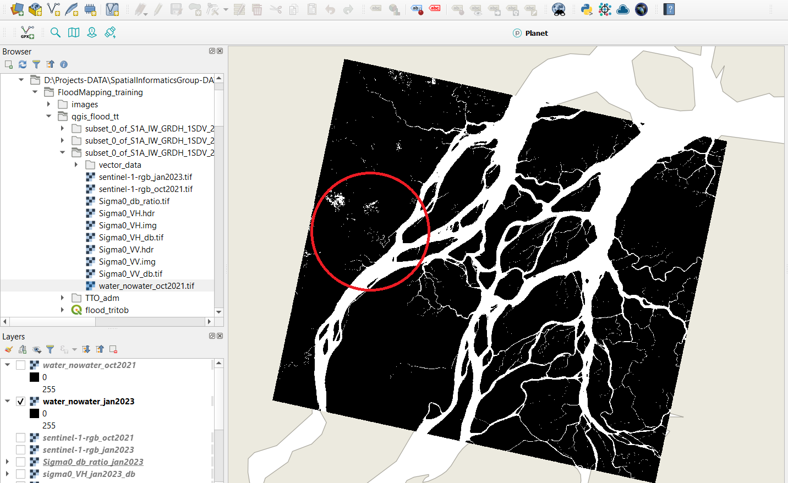
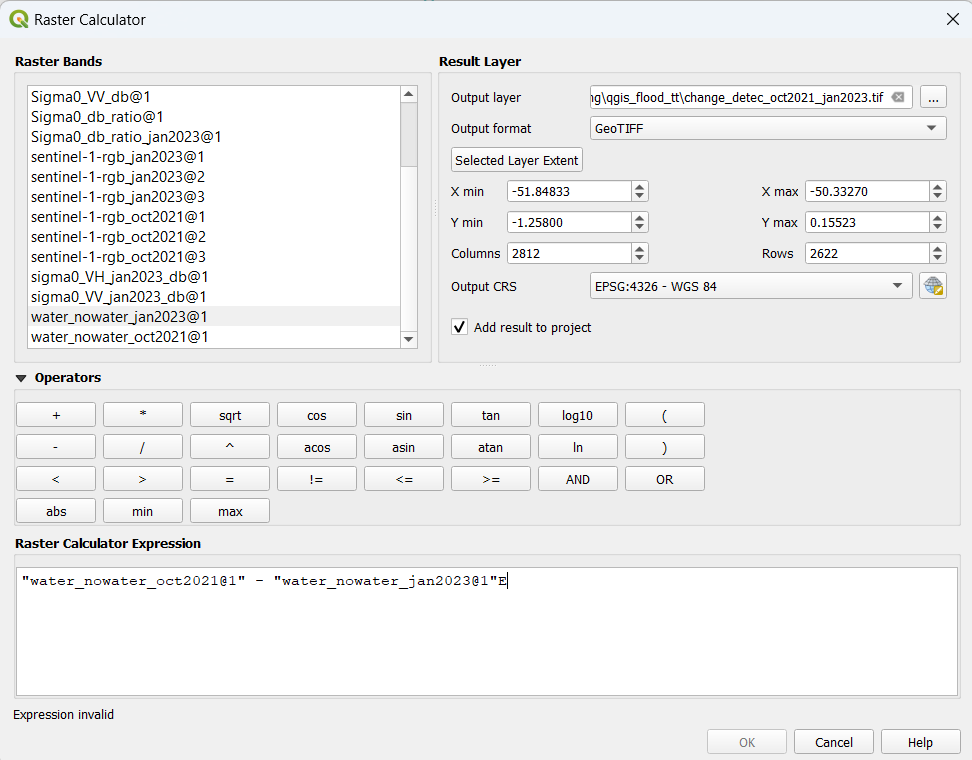
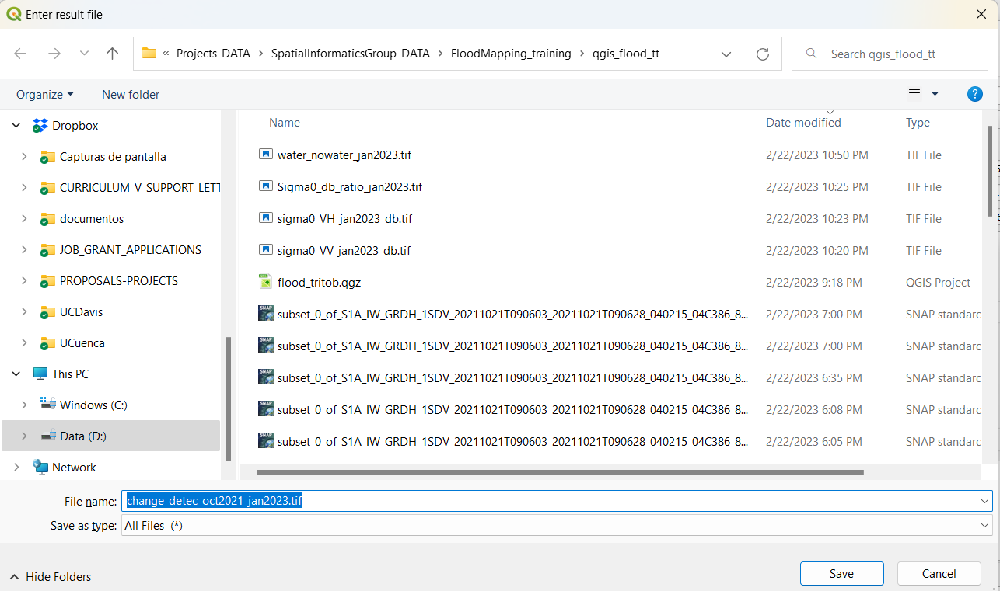
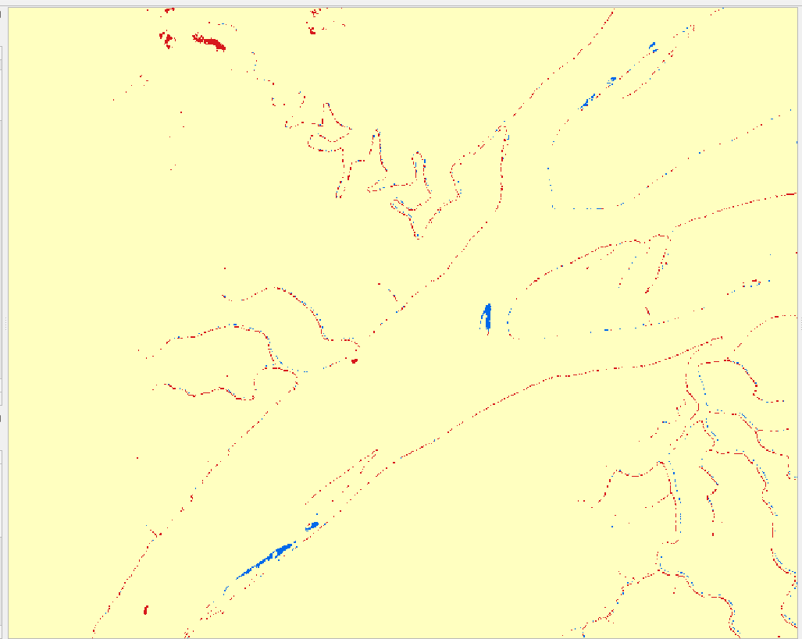
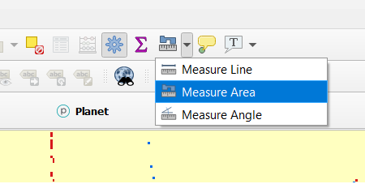

## Exercise 1: Mapping surface water using SAR data with QGIS
We are gonna use the image we obtained from our previous training (Intro to Radar), the water_nonwater.tif  raster product. In that exercise we collected the SAR Sentinel-1 image from January 2023 in a location in the Brazilian Amazon basin. We will be working in the same location and we will retrieve and pre-process a SAR image but this time from October 2021, because October is considered a rainy month, while January corresponds to a dry season. The objective is to evaluate the capacity of SAR data to map flood surface water using a multi-temporal approach by comparing both dates and tracking differences in the river flow and potential floods.
First, let’s access https://vertex.daac.asf.alaska.edu to download our new radar (SAR Sentinel-1) image. We have to specify October 2021 as our temporal filter.

**Figure 4.** Vertex platform

Under the Area of Interest field, input POLYGON((-50.985 -0.8565,-50.0179 -0.8565,-50.0179 0.0347,-50.985 0.0347,-50.985 -0.8565)), and click Search. Select the first image result. Feel free to explore the other images the search returned by scrolling through the results.  Then you can press in the ‘Add scene files to downloads’ button, or just click on the ‘L1 Detected High-Res Dual-Pol (GRD-HD)’ product download, the one that we need. Create a new folder in your computer called ‘qgis_flood_tt’ to save our new files and the following QGIS new project.

 

**Figure 5.** Products added in the queue

Now we need to process our new SAR file, following the same steps as we learnt from our previous training. We need to open the SNAP software in our computers and open the zipped file we just downloaded.

**Figure 6.** Adding the SAR file

Let’s take a look at our file added, and its structure and the four components, amplitude and phase for two polarizations.

**Figure 7.** The four polarization bands present in the SAR product.

Add the VV component in the image viewer and zoom in at different angles and locations.  Examine the heterogeneity of the pixels, and question yourself why there is such a favorable visual difference between water and non-water areas.

**Figure 8.** Visualization of the amplitude (strength of signal) Vertical-Vertical (VV) band.

Next step will be to create a subset of this image in order to reduce file size and save some computer processing time. 
Create an image subset.
In the upper menu bar, select Raster > Subset….
Set the following parameters:
Scene start X: 8775
Scene start Y: 2230
Scene end X: 23315
Scene end Y: 14930
Click OK.

**Figure 9.** Subset
Return to the Product Explorer panel. You should see a new file listed that looks like subset_0_of_[FILE NAME]. Click on the + next to the file, expand the Bands folder, and double-click on Amplitude_VV to add the subset to the image viewer. Feel free to close the previous images we opened in the viewer to keep things organized.

Perform radiometric calibration.
Click on the subset filename in the Product Explorer window to highlight the file.
In the upper menu bar, select Radar > Radiometric > Calibrate.

**Figure 10.** Image calibration
    
    a. Leave all of the default options as is, except for the directory. Set the directory as your intro-radar-data folder.

**Figure 11.** Setting directory

    b. Click Run. It may take a few seconds for the calibration to complete depending on the speed of your computer.
    c. Once the process has completed, click Close. You should see a new file listed under the Product Explorer window – this is the calibrated image.
    d. Add the Sigma0_VV band to the image viewer. This image should appear somewhat darker, as there have been multiple corrections made due to antennae pattern, signal strength, saturation, etc.

5. Reduce speckle. To filter out the image speckling, we will use a technique called multilook. Multilook divides the radar beam into a number of “sub-beams”, each of which are a single “look” at the scene. The “looks” are summed and averaged together which will reduce the amount of speckle in the final image.
    a. In the upper menu bar, go to Radar > SAR Utilities > Multilooking.
    b. In the pop-up window, click on the Processing Parameters tab. Set the Number of Range Looks to 6. Make sure the directory is set to your intro-radar-data folder.
    c. Click Run.
    d. Click Close. Another new file should appear in the Product Explorer window.
    e. Add the Sigma0_VV band to the image viewer. There is a big improvement between the original image and the new image!

6. Perform geometric calibration. Although these images have already been adjusted to ground range rather than slant range, we still need to adjust for any displacement due to terrain.
    a. In the upper menu bar, go to Radar > Geometric > Terrain Correction > Range-Doppler Terrain Correction.
    b. Note that this process relies on a digital elevation model (DEM) to make the corrections. You may customize the DEM by clicking on the Processing Parameters and selecting any of the options in the Digital Elevation Model drop-down menu, or using your own if you have one. We will be sticking with the default options for this exercise.

**Figure 12.** Reducing speckle

    c. Click Run. This process may take quite a few seconds to complete.
    d. Click Close.
    e. Add the Sigma0_VV band to the image viewer. You should now see a mirror image that looks more in line with the true color image in the World Viewer.

7. Convert sigma0 to dB. Backscatter is conventionally represented in the units dB, which is a representation of the power of the signal.
    a. Right-click on the Sigma0_VH band of the most recently corrected version of our image.
    b. Select the Linear to/from dB option.
    c. In the pop-up window, select Yes.
    d. Repeat steps a-c for the Sigma0_VV band.
    e. Add both of the db bands to the image viewer and inspect the data.

**Figure 13.** Converting to decibels

Now it’s time to work in QGIS.  We need to add the sigma0_VV and sigma0VH layers, the ones that we obtained after the final correction (just before the decibel conversion).

**Figure 14.** Adding the layers in QGIS

Now make the conversion again from linear units to decibels (amplitude) in QGIS. We use the Raster calculator.In the Raster Calculator Expression field, enter the following: **10*log10(VV).**

Now highlight the portion of the equation where it says VV and input the actual band by double-clicking on the Sigma0_VV band in the Raster Bands field. 4. Your equation should now read: 10*log10(“Sigma0_VV”). Click on the ... next to the Output layer field. Save the file in the qgis_flood_tt folder and name it Sigma0_VV_db. Click OK. Repeat steps for the Sigma0_VH band.

**Figure 15.** Conversion to decibels (db)

Take a look at our image pre-processing computation so far.

**Figure 16.** VV polarization in db units

Now we calculate the ratio. The steps are the same we applied in our previous workshop.    Select Raster > Raster Calculator.  In the Raster Calculator Expression field, enter the following: *"Sigma0_VV_db@1"/"Sigma0_VH_db@1"* . Click on the ... next to the Output layer field. Save the file in the intro-radar-data folder and name it Sigma0_db_ratio.  Click OK.

**Figure 17.** Ratio band computed

Tip: We can use a Planet visualization (if we have an account) to add a true color basemap and compare our SAR visualization. Otherwise we can use other basemaps available in QGIS. 

**Figure 18.** Planet plugin available to retrieve Planet imagery

With this band we can create a RGB product, by merging Sigma0_VV_db, Sigma0_VH_db, Sigma0_db_ratio.  

**Figure 19.** RGB visualization for the October 2021 SAR image.

Now it’s time to proceed to our classification of water /  non water by using a threshold. Confirm the threshold for our classification scheme.
    a. Right-click on the Sigma0_VH_db@1 layer name and select Properties.
    b. Click on the Histogram tab.
    c. Click Compute Histogram.
    d. A histogram with two peaks should appear. Confirm the value that separates the water values (minimum peak) from the non-water values (maximum peak).

**Figure 20.** Histogram for our October 2021 SAR image.

It appears that the value is about the same, so we can use the same threshold that we did in the SNAP software. We can add our image from our past training corresponding to January 2023

**Figure 20.** Histogram for our January 2023 SAR image.

Now, let’s continue with our October 2021 image, and create a binary image.
    a. Select Raster > Raster Calculator….
    b. In the Raster Calculator Expression field, enter the following: 255*(Sigma0_VH_db@1<-18.38)
    c. Click on the ... next to the Output layer field. Save the file in the folder and name it *water_nowater_oct2021*

**Figure 21.** Water-non water image for October 2021. The red circle indicates the region we want to focus on for our flood detection procedure.

In figure 21 we can see a zone circled in red.  This is the area that we will focus on to compared the river flow and water surface from a potential flood event occurred in October 2021, by comparing it with January 2023
Provide with color the image. Right-click on the *water_nowater_oct2021* image name in the Layers panel and click Properties. Select the Symbology tab. Next to the Render type field, choose Singleband psuedocolor from the dropdown menu. Select a color ramp or make your own. Make sure to follow the golden rules of data visualization.
Now let’s apply the change detection technique!. We will use the raster calculator to make a simple multi-temporal difference. It’s time to load the product water_nonwater file from our last training session.  Rename this last product as water_nonwater_jan2023 to make the difference with our current product. Next, applying the most common change detection approach, let’s compute the difference between both dates using Raster Calculator tool again.

**Figure 22.** Multi-temporal change detection technique

Save the resulting product with the name Change_detec_oct2021_jan2023.tif. 

**Figure 23.** Saving the new file

Now let’s look at the final result. We should be able to identify the flooded areas with bright-white colors

**Figure 24.** Multi-temporal change detection difference between a rainy month and a dry month

Using the symbology tool we can highlight the flooded parts by riverine flooding with blue color. October corresponds to the wet season, while January belongs to the dry season. 

**Figure 24.** Multi-temporal change detection difference highlighting in blue the flooded regions. Product for October 2021, using January 2023 as reference for dry land.

Let’s use the measure tool to evaluate the area of the flood.

**Figure 25.** Measure area tool.

Now draw a polygon surrounding a flooded spot of your choice.  Try to point out a large one.

**Figure 26.** Tracing a polygon to measure the area of an identified flooded area.

You can look at the secondary window for the information about the computed estimate for area. You can select different arial units for this purpose.

**Figure 27.** Measure window showing the calculated area

We found 535795.61 m² or 53.6 ha of flood occurred only in this region. The magnitude of change in water surface extent suggests this is not a normal situation of river flow, but rather a flood event. This estimate can vary a bit depending on the precision to draw the polygon of measurement around the flooded region.

Finally we can create a map using the cartographical tools from QGIS.  Don’t forget the four main components: legend, scale, north arrow, and title.

Figure 28. Flood map produced for the study area.

## Exercise 2 - challenge: 

Explore the platform SMAP Microwave Radiometer & Radar and make a short research about its functionality, data products, and applications. (https://smap.jpl.nasa.gov/)
Write down a short paragraph about these items, and download a scene for your personal region of interest using the Alaska Satellite Facility domain just as an exercise of data access. Take a look at the metadata panel to see important data.
