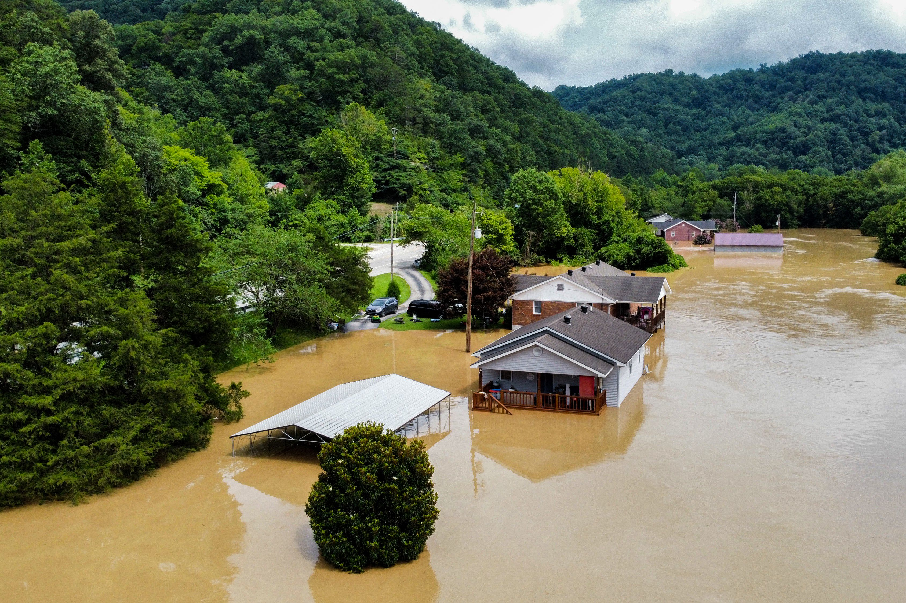

# Flood events overview

A flood is a temporary overflow of water onto land that is normally dry. Flooding is the most common disaster affecting humankind and provoking several consequences such as infrastructure destruction, crop-plantation loss, electric power outages, disruption of transportation services, landslides, etc. There are different types of floods:
pluvial floods: they are the product of intense rainfall, monsoon rains, or snowmelt
fluvial floods: they result from riverine flooding and overbank flow
storm surge floods: they happen in coastal zones due to winds and sea wave activities
overflow of dams or water reservoirs 

**Figure 1.** A flood event causing damage in lowland communities. Source: The Washington Post

## Fundamentals of satellite remote sensing for flood monitoring and mapping
Recap of Radar data, what do radars measure?
Let’s remember there are four primary parts of a radar system that allow it to collect information: Transmitter, Antennae. Receiver, Electronic processing system. The signal received is called the phase of the signal, a point in time in the position of the waveform. Radars also measure the amplitude (strength) of the reflected signal. Amplitude is called the backscatter coefficient and is expressed as the fraction of the energy that is backscattered to the radar per unit target area. The value is measured in decibels (dB) and can range from around -25 dB (very little energy reflected back) to 1 dB (high amount of energy reflected back.
The radar backscatter contains information about the Earth’s surface, which drives the reflection of the radar signal.  This reflection is driven by:
– The frequency or wavelength: radar parameter
– Polarization: radar parameter
– Incidence angle: radar parameter
– Dielectric constant: surface parameter
– Surface roughness relative to the wavelength: surface parameter

