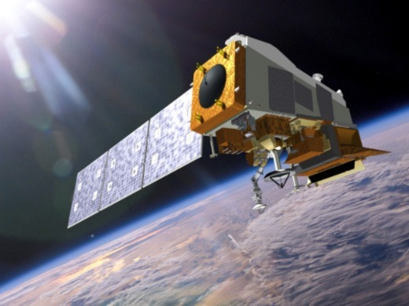

## Fundamentals of satellite remote sensing for flood monitoring
Recap of Radar data, what do radars measure?
Let’s remember there are four primary parts of a radar system that allow it to collect information: Transmitter, Antennae. Receiver, Electronic processing system. The signal received is called the phase of the signal, a point in time in the position of the waveform. Radars also measure the amplitude (strength) of the reflected signal. Amplitude is called the backscatter coefficient and is expressed as the fraction of the energy that is backscattered to the radar per unit target area. The value is measured in decibels (dB) and can range from around -25 dB (very little energy reflected back) to 1 dB (high amount of energy reflected back.
The radar backscatter contains information about the Earth’s surface, which drives the reflection of the radar signal.  This reflection is driven by:
– The frequency or wavelength: radar parameter
– Polarization: radar parameter
– Incidence angle: radar parameter
– Dielectric constant: surface parameter
– Surface roughness relative to the wavelength: surface parameter

**Figure 2**. Left images show the large river sediment inflows into the Northern Adriatic Sea in “true” color. The right images display the turbidity levels assessed with EOMAP’s EO processing system. Image source: EOMAP 2018 (https://www.eomap.com/using-satellite-data-for-flood-monitoring/)
The key idea of using satellite data for flood mapping is to map surface water in areas where we had previously land dry. A common technique for flood monitoring is multi-temporal image change detection. Other methods include water quality assessment through multi-spectral image analysis. Satellite-based tools offer one key step further by indicating how an excess rainfall phenomena can impact river flow, and also whether there is a potential for flooding downstream as a forecasting and prevention tool. Where heavy rains unfold, a flood event will likely follow. 
In general satellite remote sensing represents a powerful and accesible tool to map flooded areas.

## Relevant satellite sources for flood monitoring and mapping

Optical data:
Landsat TM, ETM, ETM+, OLIS: 07/1972 –present
Terra MODIS: 12/1999 –present
Aqua MODIS: 05/2002 –present
Suomi National Polar-Orbiting Partnership (SNPP): 11/2011-Present (OMPS, VIIRS, ATMS, CrIS, OMPS-L, CERES)

**Figure 3.** The SUOMI satellite. Image source: NASA 

Radar data
ESA Copernicus Sentinel-1A: 4/2014 –present
ESA Copernicus Sentinel-1B: 4/2016 –present
Tropical Rainfall Measuring Mission (TRMM): 11/1997 –04/2015
Global Precipitation Measurement mission (GPM): 02/2014 –present
Soil Moisture Active Passive (SMAP): 01/2015 –present
Shuttle Radar Topography Mission (SRTM) 2001

Sentinel-1 coverage
– Two satellites: A & B,  each satellite has global coverage every 12 days
– Global coverage of 6 days over the equator when using data from both satellites
