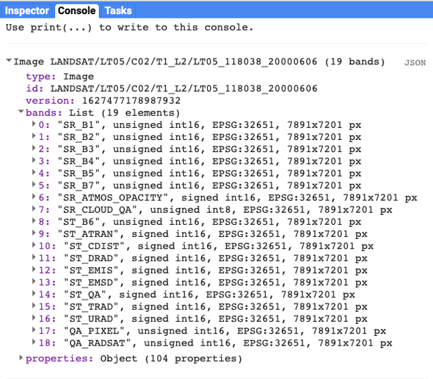
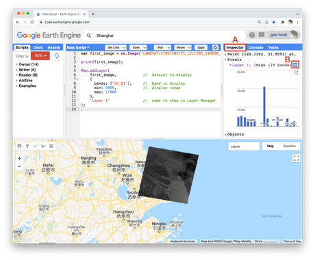
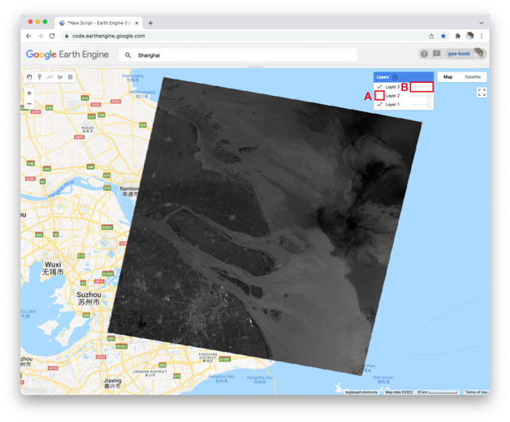

# Overview
In this module you will learn how to access images in Earth Engine's data catalog.

**Accessing an Image**

To begin, you will construct an image with the Code Editor.

```javascript
var first_image = ee.Image(
    'LANDSAT/LT05/C02/T1_L2/LT05_118038_20000606');
```

When you click **Run**, Earth Engine will load an image captured by the Landsat 5 satellite on June 6, 2000. You will not yet see any output. 

You can explore the image in several ways. To start, you can retrieve metadata (descriptive data about the image) by printing the image to the Code Editor’s Console panel: 

```javascript
print(first_image);
```

In the **Console** panel, you may need to click the expander arrows to show the information. You should be able to read that this image consists of 19 different bands. For each band, the metadata lists four properties, but for now let’s simply note that the first property is a name or label for the band enclosed in quotation marks. For example, the name of the first band is “SR_B1”.



A satellite sensor like Landsat 5 measures the magnitude of radiation in different portions of the electromagnetic spectrum. The first six bands in our image ("SR_B1" through "SR_B7") contain measurements for six different portions of the spectrum. The first three bands measure visible portions of the spectrum, or quantities of blue, green, and red light. The other three bands measure infrared portions of the spectrum that are not visible to the human eye. 

An image band is an example of a *raster data model*, a method of storing geographic data in a two-dimensional grid of pixels, or picture elements. In remote sensing, the value stored by each pixel is often called a *Digital Number* or *DN*. Depending on the sensor, the pixel value or DN can represent a range of possible data values.  

Some of this information, like the names of the bands and their dimensions (number of pixels wide by number of pixels tall), we can see in the metadata. Other pieces of information, like the portions of the spectrum measured in each band and the range of possible data values, can be found through the Earth Engine Data Catalog (which is described in the next two chapters) or with other Earth Engine methods. These will be described in more detail later in the book.  


**Visualizing an Image**

Now let’s add one of the bands to the map as a layer so that we can see it.  

```javascript
Map.addLayer(
    first_image, //  dataset to display
    {
        bands: ['SR_B1'], //  band to display
        min: 8000, //  display range  
        max: 17000
    },
    'Layer 1' //  name to show in Layer Manager
);
```


The code here uses the `addLayer` method of the map in the Code Editor. There are four important components of the command above:

`first_image`: This is the dataset to display on the map.

`bands`: These are the particular bands from the dataset to display on the map. In our example, we displayed a single band named "SR_B1".

`min`, `max`: These represent the lower and upper bounds of values from "SR_B1" to display on the screen. By default, the minimum value provided (8000) is mapped to black, and the maximum value provided (17000) is mapped to white. The values between the minimum and maximum are mapped linearly to grayscale between black and white. Values below 8000 are drawn as black. Values above 17000 are drawn as white. Together, the bands, min, and 
max parameters define visualization parameters, or instructions for data display.

`Layer 1`: This is a label for the map layer to display in the Layer Manager. This label appears in the dropdown menu of layers in the upper right of the map. 

When you run the code, you might not notice the image displayed unless you pan around and look for it. To do this, click and drag the map towards Shanghai, China. (You can also jump there by typing “Shanghai” into the **Search** panel at the top of the Code Editor, where the prompt says Search places and datasets…) Over Shanghai, you should see a small, dark, slightly angled square. Use the zoom tool (the + sign, upper left of map) to increase the zoom level and make the square appear larger.  

Can you recognize any features in the image? By comparing it to the standard Google map that appears under the image (as the base layer), you should be able to distinguish the coastline. The water near the shore generally appears a little lighter than the land, except perhaps for a large, light-colored blob on the land in the bottom of the image. 

Let’s explore this image with the **Inspector** tool. When you click on the **Inspector** tab on the right side of the Code Editor, your cursor should now look like crosshairs. When you click on a location in the image, the **Inspector** panel will report data for that location under three categories as follows:   



`Point`: data about the location on the map. This includes the geographic location (longitude and latitude) and some data about the map display (zoom level and scale). 

`Pixels`: data about the pixel in the layer. If you expand this, you will see the name of the map layer, a description of the data source, and a bar chart. In our example, we see “Layer 1” is drawn from an image dataset that contains 19 bands. Under the layer name, the chart displays the pixel value at the location that you clicked for each band in the dataset. When you hover your cursor over a bar, a panel will pop up to display the band name and “band value” (pixel value). To find the pixel value for “SR_B1”, hover the cursor over the first bar on the left. Alternatively, by clicking on the little blue icon to the right of “Layer 1”, you will change the display from a bar chart to a dictionary that reports the pixel value for each band.    

`Objects`: data about the source dataset. Here you will find metadata about the image that looks very similar to what you retrieved earlier when you directed Earth Engine to print the image to the Console.  

Let’s add two more bands to the map.

```javascript
Map.addLayer(
    first_image,
    {
        bands: ['SR_B2'],
        min: 8000,
        max: 17000
    },
    'Layer 2',
    0, //  shown
    1 //  opacity
);

Map.addLayer(
    first_image,
    {
        bands: ['SR_B3'],
        min: 8000,
        max: 17000
    },
    'Layer 3',
    1, //  shown
    0 //  opacity
);
```

In the code above, notice that we included two additional parameters to the `Map.addLayer` call. One parameter controls whether or not the layer is shown on the screen when the layer is drawn. It may be either 1 (shown) or 0 (not shown). The other parameter defines the opacity of the layer, or your ability to “see through” the map layer. The opacity value can range between 0 (transparent) and 1 (opaque). 



Do you see how these new parameters influence the map layer displays? For Layer 2, we set the shown parameter as 0. For Layer 3, we set the opacity parameter as 0. As a result, neither layer is visible to us when we first run the code. We can make each layer visible with controls in the Layers manager checklist on the map (at top right). Expand this list and you should see the names that we gave each layer when we added them to the map. Each name sits between a checkbox and an opacity slider. To make Layer 2 visible, click the checkbox. To make Layer 3 visible, move the opacity slider to the right. 

By manipulating these controls, you should notice that these layers are displayed as a stack, meaning one on top of the other. For example, set the opacity for each layer to be 1 by pushing the opacity sliders all the way to the right. Then make sure each box is checked next to each layer so that all the layers are shown. Now you can identify which layer is on top of the stack by checking and unchecking each layer. If a layer is on top of another, unchecking the top layer will reveal the layer underneath. If a layer is under another layer in the stack, then unchecking the bottom layer will not alter the display (because the top layer will remain visible). If you try this on our stack, you should see that the list order reflects the stack order, meaning that the layer at the top of the layer list appears on the top of the stack. Now compare the order of the layers in the list to the sequence of operations in your script. What layer did your script add first and where does this appear in the layering order on the map? 

Code Checkpoint: https://code.earthengine.google.com/53fc9b2a7e33fd2d1afcf6772966fe58
