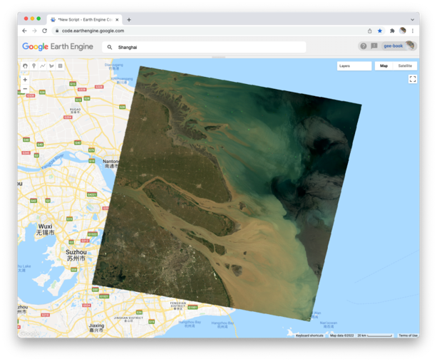
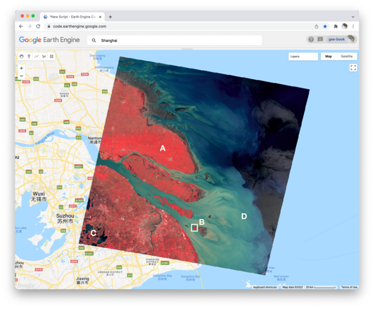
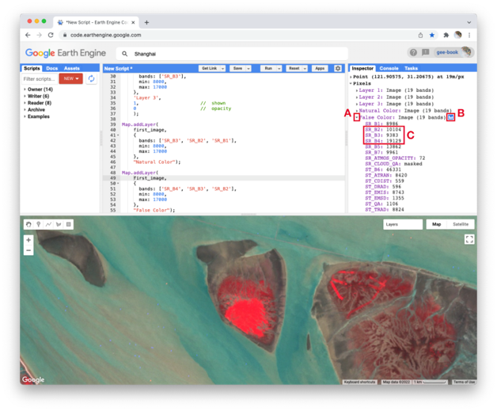
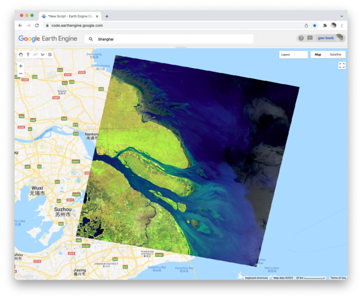
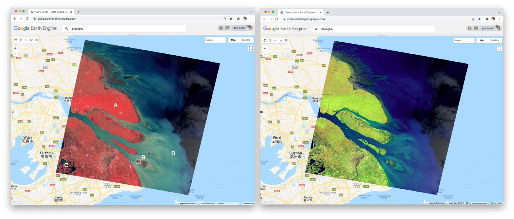

**True-Color Composites**
Using the controls in the **Layers** manager, explore these layers and examine how the pixel values in each band differ. Does Layer 2 (displaying pixel values from the “SR_B2” band) appear generally brighter than Layer 1 (the “SR_B1” band)? Compared with Layer 2, do the ocean waters in Layer 3 (the “SR_B3” band) appear a little darker in the north, but a little lighter in the south?   

We can use color to compare these visual differences in the pixel values of each band layer all at once as an RGB composite. This method uses the three primary colors (red, green, and blue) to display each pixel’s values across three bands. 

To try this, add this code and run it. 

```javascript
Map.addLayer(
    first_image,
    {
        bands: ['SR_B3', 'SR_B2', 'SR_B1'],
        min: 8000,
        max: 17000
    },
    'Natural Color');
```    


The result looks like the world we see, and is referred to as a natural-color composite, because it naturally pairs the spectral ranges of the image bands to display colors. Also called a true-color composite, this image shows the red spectral band with shades of red, the green band with shades of green, and the blue band with shades of blue. We specified the pairing simply through the order of the bands in the list: B3, B2, B1. Because bands 3, 2, and 1 of Landsat 5 correspond to the real-world colors of red, green, and blue, the image resembles the world that we would see outside the window of a plane or with a low-flying drone.  



**False-Color Composites**
As you saw when you printed the band list, a Landsat image contains many more bands than just the three true-color bands. We can make RGB composites to show combinations of any of the bands—even those outside what the human eye can see. For example, band 4 represents the near-infrared band, just outside the range of human vision. Because of its value in distinguishing environmental conditions, this band was included on even the earliest 1970s Landsats. It has different values in coniferous and deciduous forests, for example, and can indicate crop health. To see an example of this, add this code to your script and run it.  

```javascript
Map.addLayer(
    first_image,
    {
        bands: ['SR_B4', 'SR_B3', 'SR_B2'],
        min: 8000,
        max: 17000
    },
    'False Color');
```    


In this false-color composite, the display colors no longer pair naturally with the bands. This particular example, which is more precisely referred to as a color-infrared composite, is a scene that we could not observe with our eyes, but that you can learn to read and interpret. Its meaning can be deciphered logically by thinking through what is passed to the red, green, and blue color channels.



Notice how the land on the northern peninsula appears bright red (area A). This is because for that area, the pixel value of the first band (which is drawing the near-infrared brightness) is much higher relative to the pixel value of the other two bands. You can check this by using the **Inspector** tool. Try zooming into a part of the image with a red patch (area B) and clicking on a pixel that appears red. Then expand the “False Color” layer in the Inspector panel (area A), click the blue icon next to the layer name (area B), and read the pixel value for the three bands of the composite (area C). The pixel value for B4 should be much greater than for B3 or B2. 



In the bottom left corner of the image (area C), rivers and lakes appear very dark, which means that the pixel value in all three bands is low. However, sediment plumes fanning from the river into the sea appear with blue and cyan tints (area D). If they look like primary blue, then the pixel value for the second band (B3) is likely higher than the first (B4) and third (B2) bands. If they appear more like cyan, an additive color, it means that the pixel values of the second and third bands are both greater than the first. 

In total, the false-color composite provides more contrast than the true-color image for understanding differences across the scene. This suggests that other bands might contain more useful information as well. We saw earlier that our satellite image consisted of 19 bands. Six of these represent different portions of the electromagnetic spectrum, including three beyond the visible spectrum, that can be used to make different false-color composites. Use the code below to explore a composite that shows shortwave infrared, near infrared, and visible green.  

```javascript
Map.addLayer(
    first_image,
    {
        bands: ['SR_B5', 'SR_B4', 'SR_B2'],
        min: 8000,
        max: 17000
    },
    'Short wave false color');
```



To compare the two false-color composites, zoom into the area shown in the two pictures of the figure below. You should notice that bright red locations in the left composite appear bright green in the right composite. Why do you think that is? Does the image on the right show new distinctions not seen in the image on the left? If so, what do you think they are? 



Code Checkpoint: https://code.earthengine.google.com/022a47a4bdce895f830eceac85693313