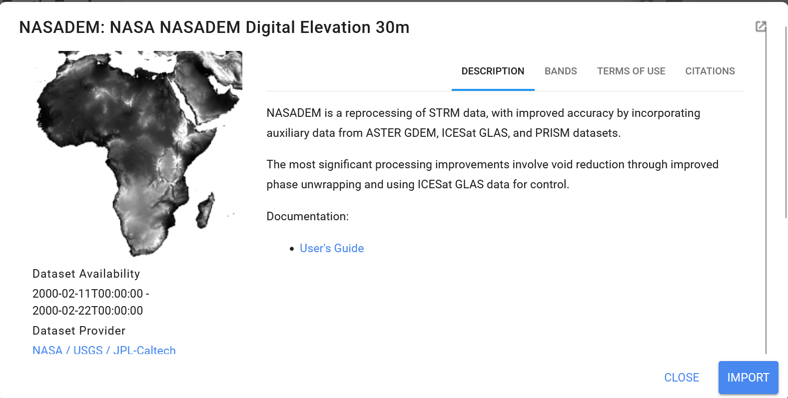
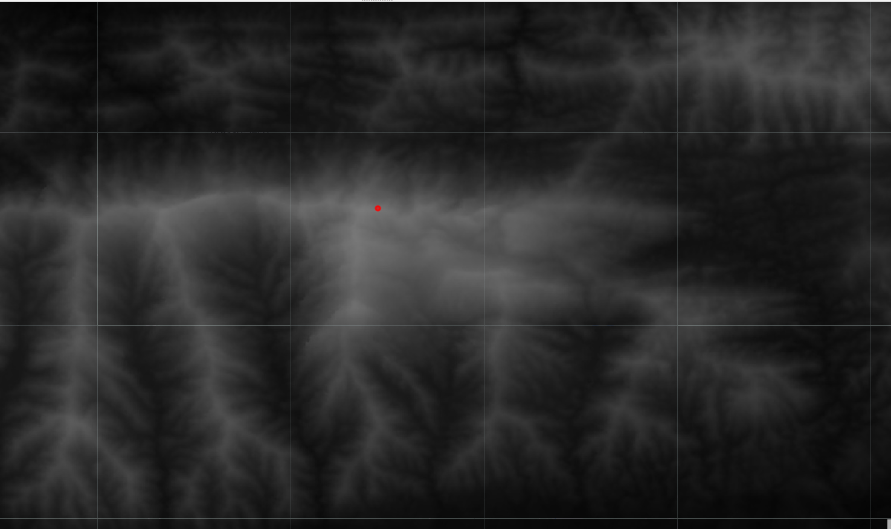

# Retrieving and visualizing elevation data

*Keep the previous script open from 'Processing & Cloud Masking Sentinel', we will continue in this section*

This exercise will walk us to the use of the NASADEM elevation dataset. Let’s remember that each product description in the GEE catalog usually brings a small portion of code to exemplify how to use it. We look for the product:


Figure 24. NASA Digital Elevation Model (DEM) listed options

The first product listed must be imported, and change the name to '*nasadem*'.



Figure 25. NASA DEM description

It’s always important to skim over the dataset product details, such as time availability, spatial scope, significant improvements over other options, and bands.


Figure 26. Product added

```javascript
//	NASA Digital Elevation Model (DEM)  
var elevation = nasadem.select('elevation');
// Set elevation <= 0 as transparent and add to the map.
elevation = elevation.updateMask(elevation.gt(0)).clip(trinidad_bou);


// Set elevation visualization properties.
var elevationVis = {
  min: 0,
  max: 2000,
};

Map.addLayer(elevation, elevationVis, 'Elevation');
```

Now let’s analyze the terrain height at some specific locations. Trinidad is traversed by three distinct mountain ranges that are a continuation of the Venezuelan coastal cordillera. The Northern Range, an outlier of the Andes Mountains of Venezuela, consists of rugged hills that parallel the coast. This range rises into two peaks. The highest, El Cerro del Aripo, is 940 metres (3,084 ft) high; the other, El Tucuche, reaches 936 metres (3,071 ft). 


Figure 27. El Cerro Del Aripo, Trinidad. [Source](http://cstrinidadandtobago.weebly.com/el-cerro-del-aripo.html)

```javascript
// Around El Cerro Del Aripo Mtn
var p01 = ee.Geometry.Point(-61.24, 10.73)

Map.addLayer(p01, {color:'red'}, 'point');
```



Figure 28. DEM layer and the location over El Cerro Del Aripo mountain

Black and gray colors correspond to lowlands and plains, while white and bright pixels correspond to highlands and mountain peaks. We are going to use the Inspector tool.  Click on it, and then we click on the point we added in order to see the elevation value we have there.


Figure 29. Inspector panel.

Hence, the values from all the add layers will be visible for the specified geographical location.


Figure 30. Location values

In the Inspector panel we will see the values for the layers we have added by code, either activated or deactivated. First, we can identify low surface reflectance values from the Sentinel layer. Second, we can observe that the elevation at this location is 901 meters. Let’s do a quick exercise of visualization. The default view of the map visor 


Figure 31. Visualization mode.

We can make use of the high-resolution images available in a true color setting to visualize the area and try to identify mountainous zones.


Figure 32. Visualization using high-resolution basemaps of GEE

We can also use the Map-terrain view to analyze elevation by contour lines


Figure 33. Map terrain view


Figure 34. Terrain view

We can easily recognize our point of reference located at the 900 m contour line.

Code Checkpoint: [https://code.earthengine.google.com/01e2c9c450bcffc966a2330e6bd5edae](https://code.earthengine.google.com/01e2c9c450bcffc966a2330e6bd5edae)