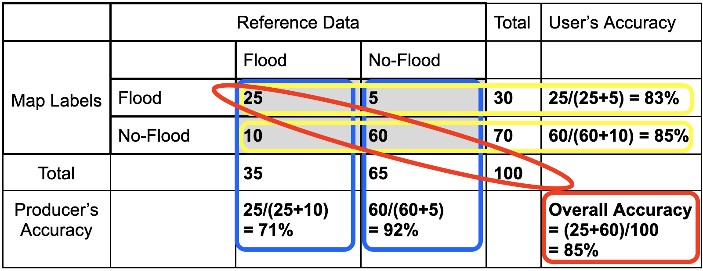

# Introduction to Map Validation - Confusion Matrix
Map validation can be performed by comparing the map classes of representative sample points to reference labels at those locations, which are collected using human interpretation and are considered to be ‘correct’ labels for these points. If the rates of agreement between the map labels and the interpreter reference labels are very high then we can infer the map is a good representation of the mapped characteristics. 

We can quantify the accuracy of the map using a confusion matrix (error matrix). The reference data dictates the actual value (the truth) while the left shows the prediction (or map classification).
    - True positive and true negative mean that the classification correctly classified the labels (e.g., a flood pixel was correctly classified as flood). 
    - False positive and false negative mean that the classification does not match the truth (e.g., a flood pixel was classified as no-flood)

 

Let’s fill in this confusion matrix with example values if 100 points were collected.
 

**Producer’s Accuracy**

* The percentage of time a class identified on the ground is classified into the same category on the map. The producer’s accuracy is the map accuracy from the point of view of the map maker (producer) and is calculated as the number of correctly identified pixels of a given class divided by the total number of pixels in that reference class. That is, for a given class in the reference pixels, how many pixels on the map were classified correctly?
* Producer's Accuracy (for flood) = True Positive / (True Positive +False Positive)
* Producer's Accuracy (for no-flood) = True Negative / (True Negative +False Negative)

**Omission Error**  
* Omission errors refer to the reference pixels that were left out (or omitted) from the correct class in the classified map. An error of omission will be counted as an error of commission in another class
* Omission error = 100% - Producer’s Accuracy
* (Flood) Omission Error is when ‘flood’ is classified as some ‘other’ category. 

**User’s Accuracy**  
* The percentage of time a class identified on the map is classified into the same category on the ground. The user’s accuracy is the accuracy from the point of view of a map user, not the map maker, and is calculated as the number correctly identified in a given map class divided by the number claimed to be in that map class. The user’s accuracy essentially tells us how often the class on the map is actually that class on the ground.
* User's Accuracy (for flood) = True Positive / (True Positive +False Negative)
* User's Accuracy (for no-flood) = True Negative / (True Negative +False Positive)

**Commission Error**
* Commission errors refer to the class pixels that were erroneously classified in the map and are complementary to the user’s accuracy
* Commission error = 100% - user’s accuracy.
* (Flood) Commission Error is when ‘other’ is classified as ‘flood’.

**Overall Accuracy**
* Overall accuracy = (True Positive + True Negative) / Sample size
* The overall accuracy essentially tells us what proportion of the reference data was classified correctly
