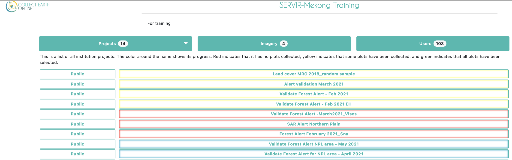
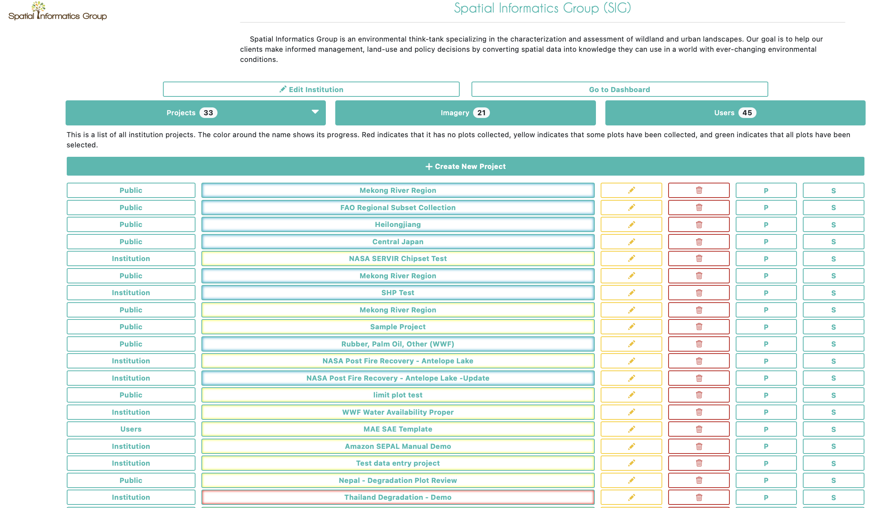
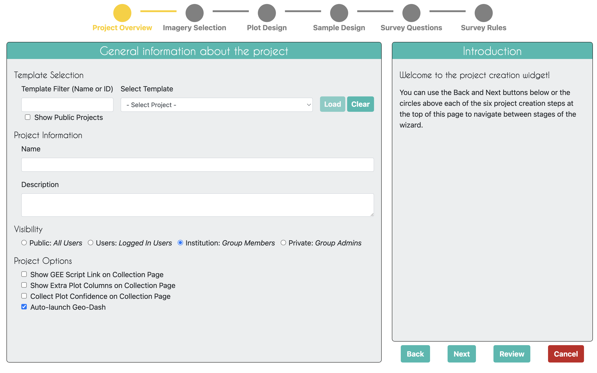
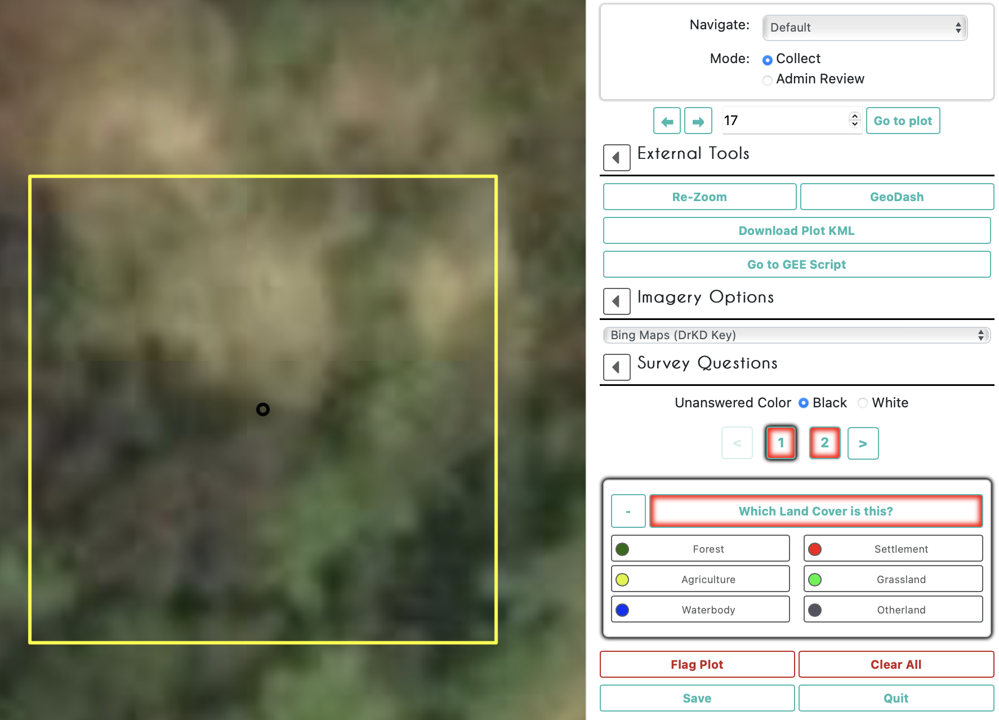

# Hands On Demonstration - Introductory Tour of CEO 

## General Help
>If you ever need help with your work in CEO a good place to start is with the 'Support' and 'Blog' pages linked at the top of the CEO website. Tutorials are provided for project creation and interpretation 

## Institution Homepage
The Projects homepage of your institution will contain a list of your group’s projects. Completed projects will be outlined in green, partially completed in yellow, and those without any collected data in red. On the left the projects’ privacy levels will be indicated.
* **Public - All**: All users can see and contribute data to your project. Admins can use your project as a template.
* **Users - Logged in Users**: Any user logged into CEO can see and contribute to your project. Admins can use your project as a template.
* **Institution - Group Members**: Members of your institution can see and contribute to your project. Admins from other institutions cannot use your project as a template.
* **Private - Group Admins**: Only your Institution’s Admins can see and contribute to your project. Admins from other institutions cannot use your project as a template.

 

If you are an administrator of your institution you will also see more buttons to the right of each project. The button with the pencil icon allows you to edit a project. You can edit everything about a project before it is published, but only a few things once it is published and open for official data collection. The trash can button will delete a project, which cannot be undone. The P and S buttons are for downloading collected data from a project. There are two data download options: Download Plot Data, which downloads your data summarized by plot, and Download Sample Data, which downloads your raw data, with information for each point within each plot as its own row. Both are downloaded in .csv, which can be opened in programs like Microsoft Excel or imported into data analysis software. Data downloaded from CEO will be in WGS84 EPSG:4326 format.

 

If you click on the 'Imagery' button near the top of the institution page you will see a list of imagery that is built-in to CEO, including MapBox and Planet NICFI data, and any other imagery that has been added to your institution. CEO provides two easy ways to add your own imagery to your projects. The first is by connecting your own imagery via Web Map Service (WMS) or Web Map Tile Service (WMTS), and the second is by connecting your imagery hosted in Google Earth Engine (GEE). More details on how to add your own imagery are available in this [CEO Blog](https://blog.collect.earth/index.php/2022/04/21/connecting-gee-raster-data/) and the [Project Creation Manual](https://www.collect.earth/ceo-guides/#:~:text=Institution%20%26%20Project%20Creation%20Manual%20(English)).

Under the 'Users' tab will be a full list of all email addresses that are a part of your CEO institution. These users will have different permissions based on their status as an Admin or a Member of the institution. You can add more CEO users to your institution from this page.

## As an Admin User: What You Will Find Inside a CEO Project?
When creating a project an admin user will start on a page that looks like this.
 

## As an Interpreter: What You Will Find Inside a CEO Project?
You can begin collecting data under any published project by clicking on the button with that project’s name in your institutions project page. Multiple users can collect in the same project at the same time, as they will automatically be directed to different plots within the project.

This is an example of what a collector will see at each sample interpretation.
 