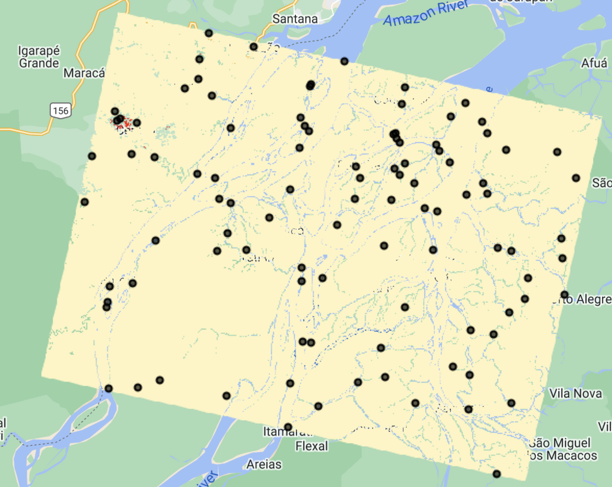

# Introduction to Stratified Random Sampling
There are several different ways to sample an area in order to achieve a representative sample or the landscape and the variations within it. Sample data gathered in CEO can be used for a variety of purposes, including map validation.

 

**Systematic Sampling**: observations are placed at equal intervals according to a strategy

 

**Simple Random Sampling**: observations randomly placed

 
**Stratified Random Sampling**: Using a map to inform the design, a minimum number of observations randomly placed in each category

Stratified random sampling has two key benefits
* Updates map-based areas to increase precision (reduces uncertainty)
* Helps increase chance of having plots in rare classes

We will use stratified random sampling to perform a map validation analysis. You can use different tools, such as Google Earth Engine, to generate the locations of the sample points. 

We will use the map you developed in the last training to illustrate this process. Remember this is an image of multi-temporal change detection differences, highlighting the flooded regions in blue and areas that converted from water to dry land in red. This product was generated for October 2021, using January 2023 as reference for dry land.

 

We have pre-calculated approximate pixel counts of the map classes using Google Earth Engine.

| Map Value | Readable Map Class | Pixel Count      | % of Total   |
|-----------|--------------------|------------------|--------------|
| 1         | no change          | 157,468,716      |  99.11%      |
| 2         | flood              | 278,136          |  0.18%       |
| 3         | water removed      | 1,141,884        |  0.72%       |

If we had used systematic or random sampling we might only get a flooded or water removal point in less than 1 out of every 100 points we collect. That is super inefficient for looking at the classes of interest. With stratified random sampling I can put a minimum value on the number of points in each map class, or strata. We have pre-prepared a set of points with 30 in the smaller two stratas and the remaining 40 points in the area mapped as no change from flooding, for a total of 100 sample points. 
The stratified random sampling was performed in GEE using this [script](https://code.earthengine.google.com/0d872d5d419349fadd40399620f397f1), which exports a CSV of sample locations ready to be imported into CEO. 

*Download that CSV file [here](https://drive.google.com/file/d/1pkTgPXJFrJp7FePiz8UwcB6xEoFEWfYr/view?usp=share_link).*

The included 100 samples are distributed within the assigned map strata.
 