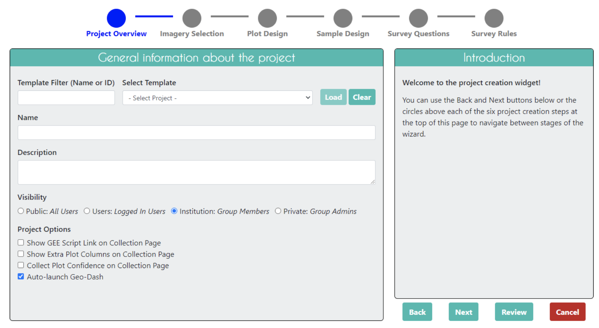
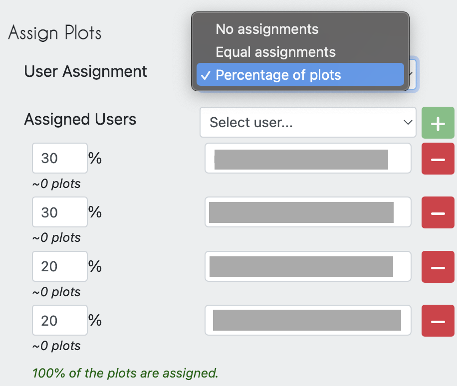
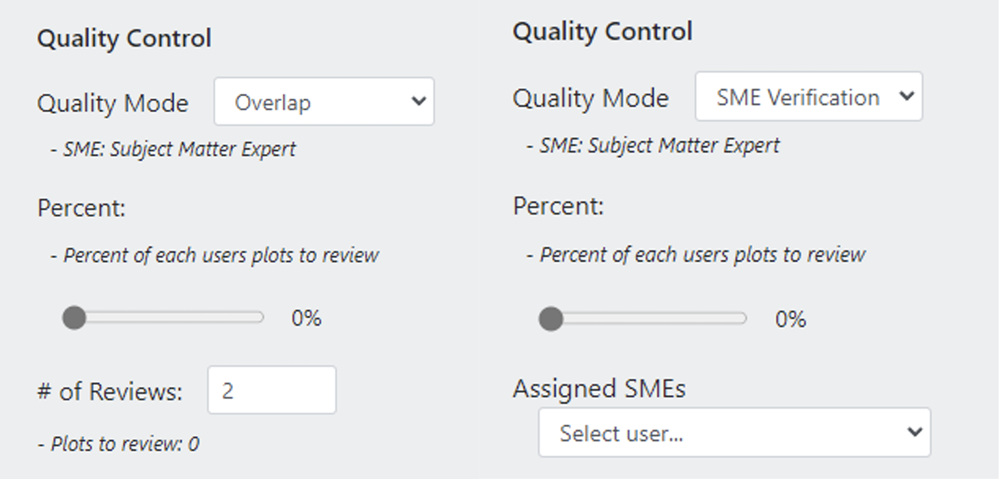
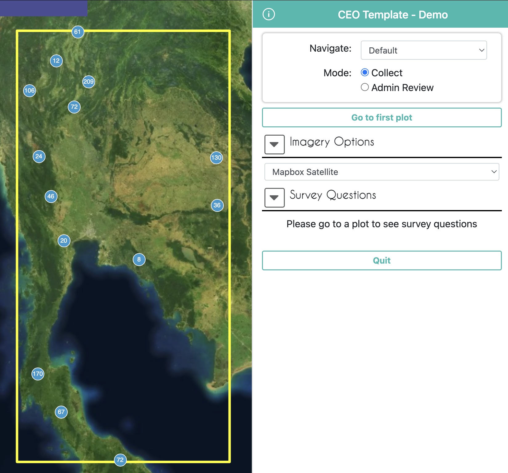
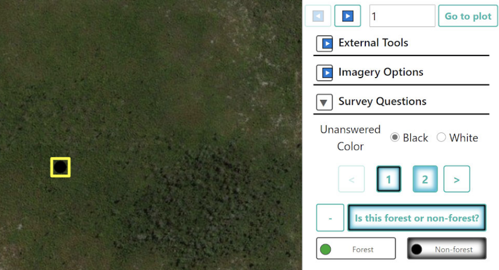
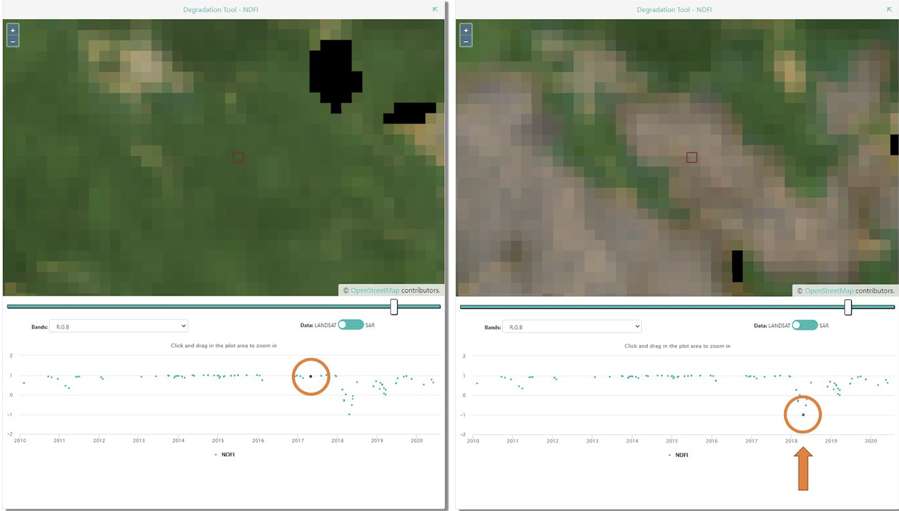

# Introduction
Welcome to an Introduction to Collect Earth Online (CEO)! This workshop will give an overview of CEO and how to use it for data collection.  

*Note, this workshop will be recorded for later reference*

## Pre-workshop set-up
Make sure you have joined the CEO institution for this workshop **“Trinidad and Tobago Geospatial Workshop”**. See further details on the pre-workshop set up page. [Pre-Workshop Set Up](../intro-to-ceo/pre-workshop-set-up.md)

## Objectives
1. Understand the uses and benefits of CEO.
2. Get set up on CEO with an account and institution.
2. Learn how to create a CEO project for data collection. 
3. Learn interpretation best practices in CEO.

## What is CEO and why use it?
>Collect Earth Online (CEO) is a custom built, open-source, **satellite image viewing and interpretation platform** created to collect reference data needed to classify and monitor land cover / land use change. CEO aims to help organizations across the world gain **an accurate picture of what’s happening on the ground**, detecting the effects of deforestation, forest degradation, crop loss, and other changes in land use.

CEO marks a new approach to data collection. For any Earth observation inventory or mapping effort, gathering reference data is essential. Relying on local experts to interpret satellite imagery offers a cost-effective way to calibrate data and assess map accuracy, eliminating the need for time-consuming data collection in the field.

CEO can be used for a variety of projects related to remote sensing, map making, and resource inventories. Some of the most common uses for CEO are: 
* Producing reference data for sample-based area estimation
* Producing reference data for map validation 
* Producing training data for modeling methods

CEO brings science to non-specialists by providing a free, open-source, intuitive platform for interpreting satellite imagery and answering environmentally critical questions regarding land cover, land use, forestry, and agriculture. CEO has attracted a dedicated global community of users who rely on the platform to drive high-impact work monitoring deforestation and other types of land use change. Initially developed by SERVIR—a joint venture of the National Aeronautics and Space Agency (NASA) and the U.S. Agency for International Development (USAID)—CEO is now supported by a broad base of partners.  

Collect Earth Online (CEO) is available at https://collect.earth/. 

 

## Key benefits of CEO
* Easy to use even for those with a limited background in remote sensing 
* Implemented online, so users do not need to worry about desktop installation or data backups
* Cloud based software that is free and accessible to all
* Enables multiple users to work simultaneously on the same data collection project
* Software promotes consistency in locating, interpreting, and labeling reference data plots; along with automated quality control options to gauge interpreter agreement 
* Access to multiple sources of satellite imagery for any location on Earth, including datasets like the high-resolution Planet imagery from Norway’s International Climate & Forests Initiative (NICFI)
* Integrated with land cover classification and area estimation tools such as SEPAL and GEE
* Sample data can be used for area estimation required by REDD+ and similar initiatives

## Example Applications of CEO
* Map validation, reference data for accuracy calculations
* Reference data for model calibration
* Unbiased area and uncertainty estimation
* Monitoring reporting and verification
* Verification for near-real time monitoring models

## Quick Tour of How CEO is Used

1. **Create a personalized project**: Select imagery options and choose your area of interest, sampling design, and questions to ask.
 

2. **Collaborate**: Work with colleagues in your organization or with community scientists from around the world — the cloud makes collaboration easy. You can also use CEo to organize the work load for your team, assigning proportions of the samples to team member, and specifying how many samples need to be reviewed by more than one person.

 
 

3. **Collect data**: The intuitive interface makes it easy to collect standardized information about the landscapes you care about.

 
 

 
