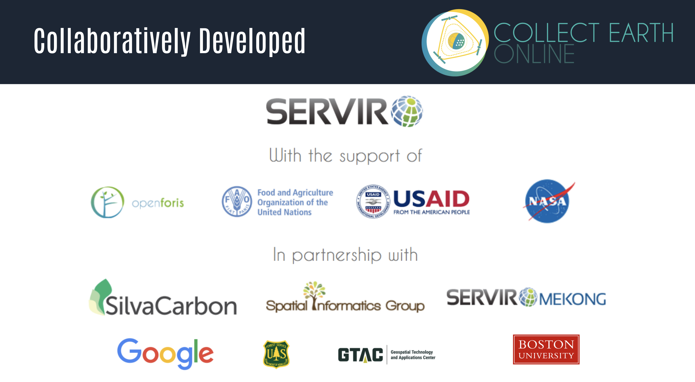
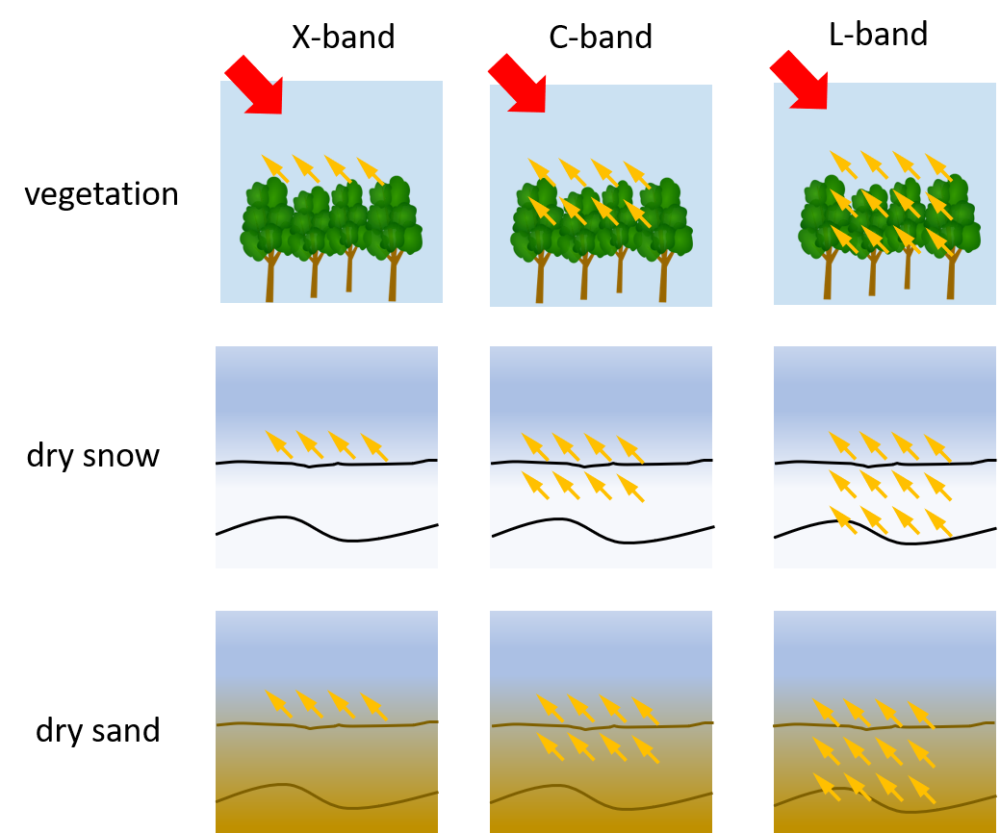
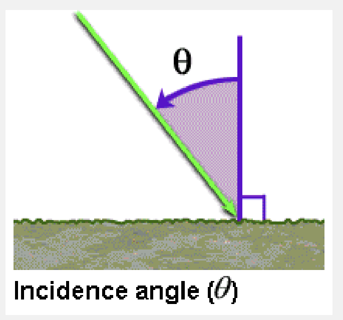
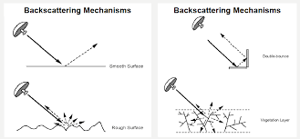

# Introduction

Welcome to an Introduction to Collect Earth Online (CEO)! This workshop will give an overview of CEO and how to use it for data collection.  To start off, this section will cover ...

## Pre-workshop set-up
1. Create a [CEO account](https://app.collect.earth/register). Remember the email address you used to make this account.
2. If your organization already has a CEO Institution, request to join that institution. We will also cover this step in the workshop, and make an institution if your organization does not have one.
3. Install [Google Earth Pro](https://support.google.com/earth/answer/21955?hl=en)
4. Create a [Google Earth Engine (GEE) account](https://earthengine.google.com/new_signup/) (Optional)

## Objectives
1. Understand the uses and benefits of CEO.
2. Get set up on CEO with an account and institution.
2. Learn how to create a CEO project for data collection. 
3. Learn interpretation best practices in CEO.

## What is CEO and why use it?
>Collect Earth Online (CEO) is a custom built, open-source, **satellite image viewing and interpretation platform** created to collect reference data needed to classify and monitor land cover / land use change. CEO aims to help organizations across the world gain **an accurate picture of what’s happening on the ground**, detecting the effects of deforestation, forest degradation, crop loss, and other changes in land use.

CEO marks a new approach to data collection. For any Earth observation inventory or mapping effort, gathering reference data is essential. Relying on local experts to interpret satellite imagery offers a cost-effective way to calibrate data and assess map accuracy, eliminating the need for time-consuming data collection in the field.

CEO can be used for a variety of projects related to remote sensing, map making, and resource inventories. Some of the most common uses for CEO are: 
* Producing reference data for sample-based area estimation
* Producing reference data for map validation 
* Producing training data for modeling methods

CEO brings science to non-specialists by providing a free, open-source, intuitive platform for interpreting satellite imagery and answering environmentally critical questions regarding land cover, land use, forestry, and agriculture. CEO has attracted a dedicated global community of users who rely on the platform to drive high-impact work monitoring deforestation and other types of land use change. Initially developed by SERVIR—a joint venture of the National Aeronautics and Space Agency (NASA) and the U.S. Agency for International Development (USAID)—CEO is now supported by a broad base of partners.

 
Surface penetration based on wavelength. *Source: SAR 101: An Introduction to Synthetic Aperture Radar, Daniel Hogan*

## Data Collection
### Passive vs. Active Measurements
This concept should sound familiar, as we briefly discussed it in the Introduction to Remote Sensing lesson. It is a key difference, however, so we will discuss it far more in depth here.

Optical sensors are called passive sensors because they rely solely on energy from an outside source (e.g, the sun) to capture their measurements. This reliance on outside energy sources limits these sensors by the effects of the atmosphere. Energy that is simply reflected from the surface of the Earth cannot penetrate things such as cloud cover or fog, and thus makes it difficult to gather data consistently in areas that experience this type of weather often.

### What do radars measure?

**Radar components.** There are four primary parts of a radar system that allow it to collect information:
1. **Transmitter.** This device outputs short bursts of microwave energy at regularly scheduled intervals. (The “active” part of active remote sensing!)
2. **Antennae.** The antennae focuses the series of pulses from the radar into a beam that illuminates the surface at a right angle to the motion of the platform. 
3. **Receiver.** The antennae receives the energy that is reflected, or *backscattered*, from the Earth’s surface. The time at which the energy is received by the antennae allows the system to pinpoint the location of the object it reflected off of.
4. **Electronic processing system.** This system processes the backscattered signal to generate an image.

In addition to the time at which the signal is received, which is referred to as the phase (a point in time in the position of the waveform) of the signal, radars also measure the amplitude (strength) of the reflected signal. Amplitude is called the *backscatter coefficient*, or $\sigma_{0}$, and is expressed as the fraction of the energy that is backscattered to the radar per unit target area. The value is measured in decibels (dB) and can range from around -25 dB (very little energy reflected back) to 1 dB (high amount of energy reflected back.

Surface penetration based on wavelength. *Source: SAR 101: An Introduction to Synthetic Aperture Radar, Daniel Hogan*

**Polarization.** Radar signals are polarized and usually denoted as **horizontal (H)**, or **vertical (V)**. These polarizations affect the way that the signal is both transmitted and received and the physical properties of an object that are detected. There are four typical polarization combinations:
* HH: horizontal transmit, horizontal receive
* VV: vertical transmit, vertical receive
* HV: horizontal transmit, vertical receive
* VH: vertical transmit, horizontal receive

**Incidence angle.** The final factor to consider is the incidence angle, &theta;, which is the angle between the direction of the radar beam and the plan perpendicular to the surface of the Earth.

Incidence angle. *Source: NASA Applied Remote Sensing Training Program*&nbsp;  

The larger the incidence angle, the greater the sensitivity to surface roughness. These beams will be able to penetrate less deep than beams that have smaller incidence angles, and also result in lower levels of backscatter.

### Surface Effects
The factors we discussed above are all radar properties that will affect the backscatter received by the radar. There are also surface properties that have an effect on the backscatter. The combination of these effects makes an impact on the data the sensor collects, and thus the data provides information on the following two surface parameters. 

**Surface roughness.** Surface roughness is defined as the average height variations in the surface cover on the order of centimeters. This factor has the primary impact on the tones of a radar image and level of backscattering. Smooth surfaces, or surfaces where the variations in height are much smaller than the radar wavelength, appear darker in radar images while rough surfaces appear lighter. This difference is due to the type of **backscattering mechanism** that the type of surface triggers. There are four primary types of backscattering:
1. **Specular reflection.** Smooth surfaces tend to reflect all of the energy away from the radar. These areas appear very dark in radar images. Ex: open water
2. **Diffuse reflection.** Rough surfaces, where the level of roughness approaches the length of the microwave, start to reflect some of the energy back to the radar. These areas appear somewhat brighter. Ex: rocky open areas, grasslands.
3. **Double bounce reflection.** This type of reflection occurs when energy bounces off a smoother surface and then bounces again on a nearby, vertical object so that most of the energy scatters back to the radar. These areas appear very bright. Ex: urban areas, inundation
4. **Volume scattering.** This type of scattering occurs within a volume or medium. Energy bounces of a number of different elements within the medium to cause wide amounts of scattering, some of which returns to the radar. The brightness can vary, but is usually moderately bright. Ex: snowpack, forests.

Backscattering mechanisms. *Source: Advantages and Applications of Synthetic Aperture Radar as a Decision Support Tool, Molthan et al., NASA*

**Dielectric properties.** The dielectric properties of a material have a big effect on the surface’s ability to absorb or reflect microwaves – so much so that the magnitude of the backscatter is proportional to the dielectric constant of the surface. Liquid water has a much higher dielectric constant than other materials including frozen water (a dielectric constant of 80 compared to a range of 0-10), and so the presence or absence of water defines a surface’s dielectric properties. For the most part, surfaces with high dielectric constants have higher reflectivity and thus appear brighter than those with lower dielectric constants.

