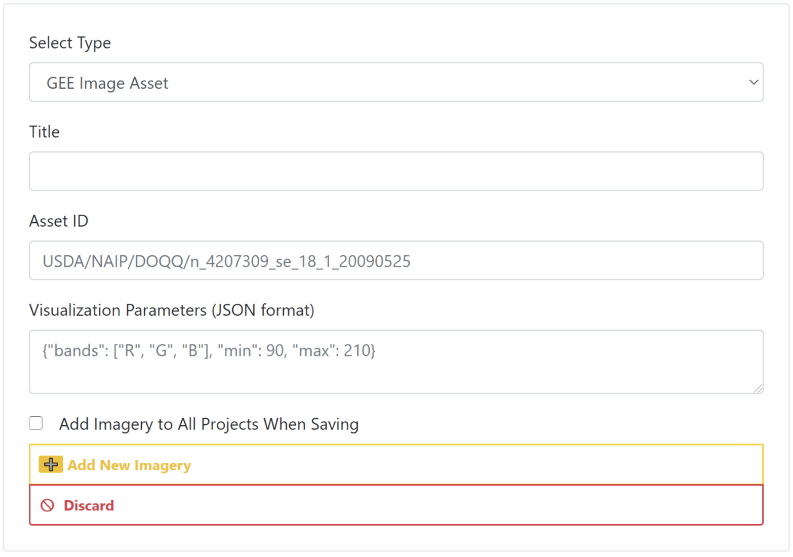

# Hands On Demonstration - Creating a CEO project

## CEO Imagery
Before you start making a project take a look at what imagery is established for your CEO institution. Determine whether you would like to add any more imagery options to your institution so they can be utilized in your project. Some imagery is already built into CEO, and some (BingMaps, Planet Monthly, Planet Daily, Planet NICFI, SecureWatch, and the MapBox products) will require an API key. You will be asked to provide this key in the CEO imagery setup panel. can be accessed if you have. You can add your own imagery to CEO via Web Map Service (WMS) / Web Map Tile Service (WMTS), or by connecting to your publicly shared imagery hosted in Google Earth Engine (GEE).

*Note, we have created an extensive how-to and troubleshooting guide for adding GEE Image Assets and Image Collection Assets to CEO. It is available in CEO’s blog [here](https://blog.collect.earth/index.php/2022/04/21/connecting-gee-raster-data/). General directions on how to add your own imagery using GEE are provided below, which you can try out after this workshop.*

&nbsp;

>*Bonus Material for After Workshop* - Adding a GEE Image Asset

>* Google Earth Engine (GEE) Assets include user’s uploaded assets along with assets provided by other users and GEE. Information on Assets can be found [here](https://developers.google.com/earth-engine/guides/asset_manager). More detail on uploading your own assets is below. Note that Image Asset refers to a single image (e.g. a GeoTIFF layer) while ImageCollection Asset refers to a stack of images (e.g. GeoTiff layers of the same location over different dates).
>* **Title**: This will be the displayed name of the imagery.
>* **Asset ID**: The Asset ID for your image asset. Will have a format similar to: USDA/NAIP/DOQQ/n_4207309_se_18_1_20090525
>* **Visualization Parameters (JSON format)**: Any visualization parameters for your layer. For example, {"bands":["R","G","B"],"min":90,"max":210}
>* If you want to add this imagery source to all of your institution’s projects, check the box next to Add Imagery to All Projects When Saving.
?6. When all fields are filled out, click on 'Add New Imagery'.

> 

If you are unfamiliar with GEE, directions for uploading your own image assets to GEE are provided below. You must have a GEE account to complete this process.

&nbsp;

>*Bonus Material for After Workshop* - Adding a GEE ImageCollection Asset

>* Google Earth Engine (GEE) Assets include user’s uploaded assets along with assets provided by other users and GEE. Information on Assets can be found here: https://developers.google.com/earth-engine/guides/asset_manager. More detail on uploading your own assets is below. Note that Image Asset refers to a single image (e.g. a GeoTIFF layer) while ImageCollection Asset refers to a stack of images (e.g. GeoTiff layers of the same location over different dates).
>* *Title*: This will be the displayed name of the imagery.
>* Asset ID: The Asset ID for your image asset. Will have a format similar to: LANDSAT/LC08/C01/T1_SR
>* **Start Date**: The default start date of imagery to display.
>* **End Date**: The default end date of imagery to display.
>* **Visualization Parameters (JSON format)**: Any visualization parameters for your layer. For example, {"bands":["B4","B3","B2"],"min":0,"max":2000}
If you want to add this imagery source to all of your institution’s projects, check the box next to Add Imagery to All Projects When Saving.
>* When all fields are filled out, click on [Add New Imagery].
>* Note that to display the GEEImageCollection, CEO uses the “mean” reducer in Earth Engine. This takes the mean of any images in the image collection during the time period specified.

&nbsp;

We have created an extensive how-to and troubleshooting guide for adding GEE Image Assets and Image Collection Assets to CEO. It is available in CEO’s blog here: https://blog.collect.earth/index.php/2022/04/21/connecting-gee-raster-data/. 
Uploading GeoTIFF images to GEE:
Visit https://code.earthengine.google.com/
Navigate to Assets
Click New, then under Image Upload click GeoTIFF.
