# Data Access
Accessing remote sensing data has become easier than ever in recent years. This lesson will walk through two methods of accessing some of the most widely used geospatial datasets.

## Objectives
1. Use Earth Explorer to find Landsat 8 and 9 scenes for a specific date and location.
2. Locate Sentinel-2 scenes for a specific date and location using Copernicus Open Access Hub.

## Earth Explorer
**What is Earth Explorer?** The USGS Earth Explorer is one-stop data portal for accessing geospatial datasets from the USGS collection. Users can interact with a user interface to filter data by location via the displayed map, inputting exact coordinates, or uploading a shapefile. The data can further be filtered by date range, dataset type, and additional criteria. 

### Exercise 1.1. Practice Using Earth Explorer.
This exercise will demonstrate how to utilize Earth Explorer to locate and download Landsat 8 scenes for a particular date range and area of interest. For this lesson, our area of interest is the **western coast of Jamaica** and the date range is **September 1, 2022 to September 21, 2022**.

1. Navigate to the Earth Explorer home page: [https://earthexplorer.usgs.gov/](https://earthexplorer.usgs.gov/). Sign in to your Earth Explorer account.
2. **Filter by location.** Select the `Search Criteria` tab in the upper lefthand corner. Input the area of interest using ONE of the following methods:
    1. **Search**
        1. Select the Geocoder tab and then select `World Features` underneath the `Search Limits` description. Type `Negril` into the Feature Name field and press `Show`. Select the second entry that comes up.
        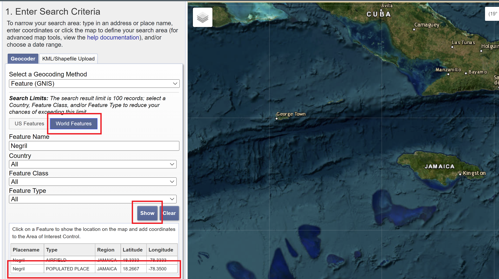

    2. **Interactive map**
        1. Scroll down to the `Polygon` tab. Drag the map and zoom in to Negril. Select `Use Map` to highlight the area shown on the map. 
        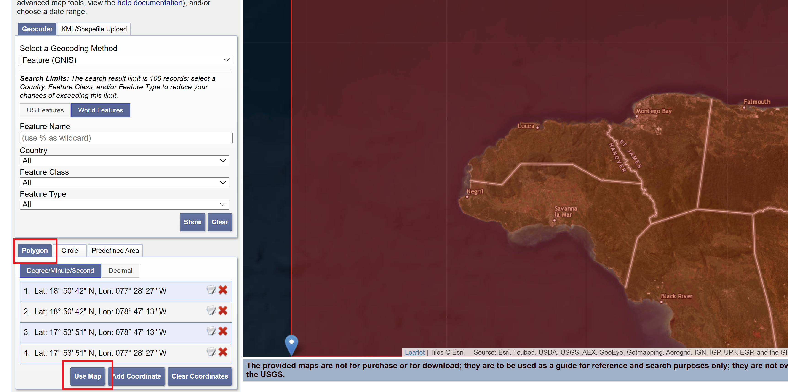
    3. **Coordinates**
        1. Scroll down to the `Polygon` tab. Select `Add Coordinate`.  Input `18&deg; 16' 00" North` as the latitude and `78&deg; 21' 00" West` as the longitude and press `Add`. 
        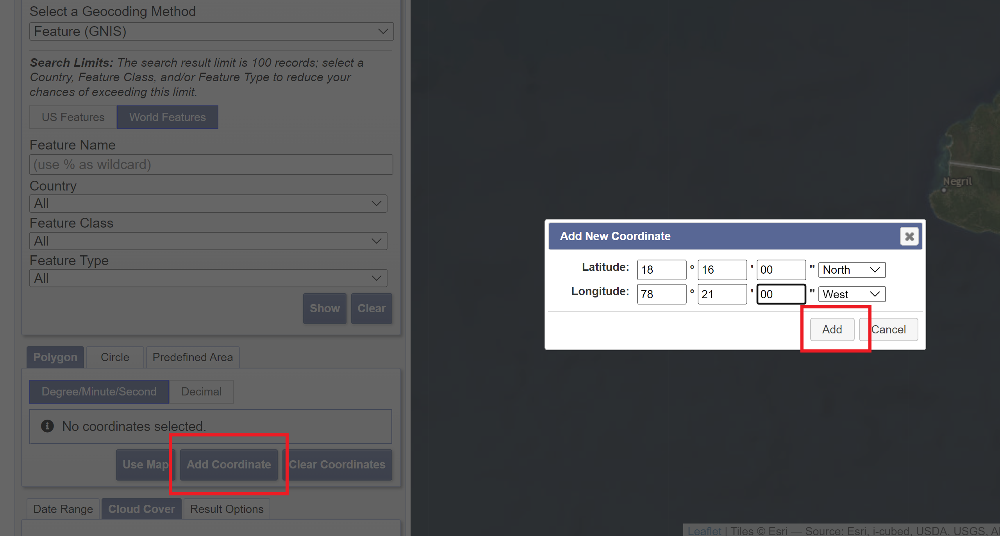
    4. **Shapefile**
        1. Select the `KML/Shapefile Upload` tab. In the dropdown menu, choose the `Shapefile` option and press `Select File`. Navigate to the `intro-rs-data` folder and choose `negril_pa_shapefile.zip` and press `Open`.
        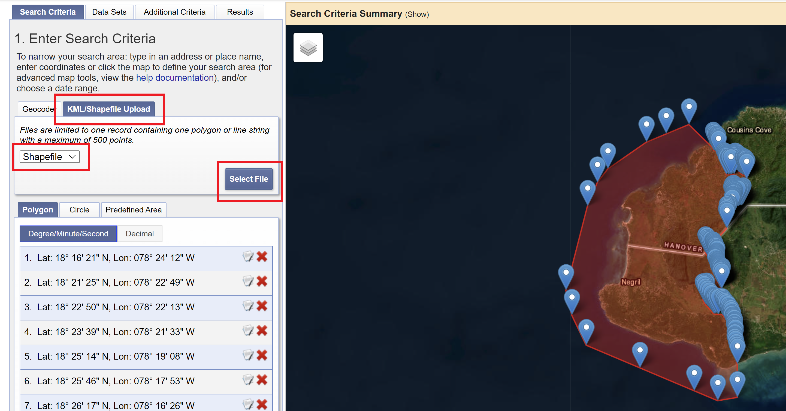
3. **Filter by date and cloud cover.** Scroll down to the bottom of the `Search Criteria` tab and input `09/01/2022` to `09/21/2022`. Next, press the `Cloud Cover` tab and move the slider so that the range is set between `0% to 15%`. Press the `Data Sets >>` button to move on to the next section.
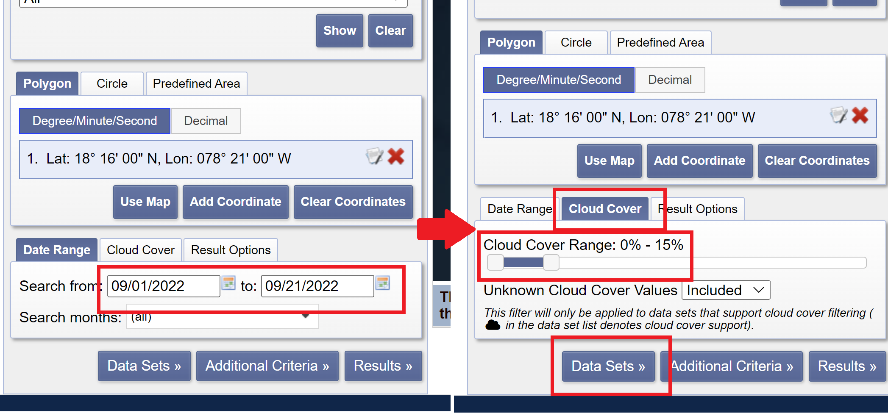
4. **Filter by data set.** Under the `Data Sets` tab, expand the section labeled `Landsat`. We want to use the most recent collection of Landsat data, so choose the `Landsat Collection 2 Level-1` option. Check the `Landsat 8-9 OLI/TIRS C2 L1` box option. Select the `Additional Criteria >>` button to move on to the next section.
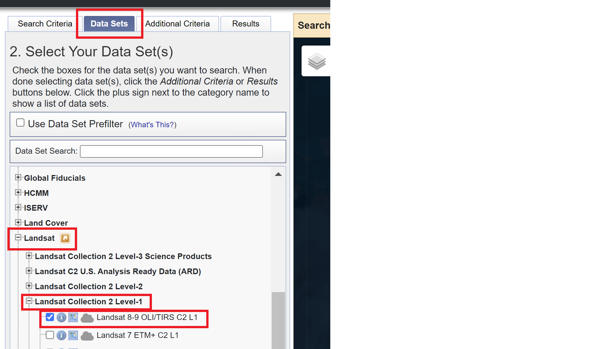
5. We do not need to filter by any additional criteria, but you can explore what options are available for the Landsat 8-9 Collection 2 Level 1 data set in this tab. Press `Results >>` to see the available data.
6. Select the first image result. You can see what the image looks like and scroll down to learn about the metadata. The image should have the following properties:
    1. **ID:** LC08_L1TP_012047_20220916_20220922_02_T1
    2. **Date Acquired:** 2022/09/16
    3. **Path:** 012
    4. **Row:** 047
    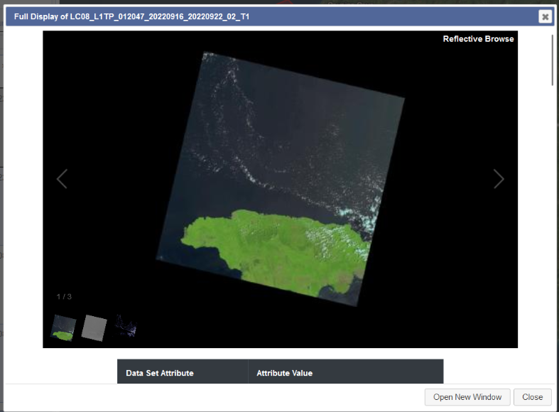
7. Press the download icon to see the options for download. **Note that you must be signed in to complete this step.** You can explore the different formats that you can choose to download the data. The best choice for analysis is the “Product Bundle.” Downloading data can sometimes take a while, so all the data needed for the rest of the workshop has been downloaded for you and included in the `intro-rs-data` folder.

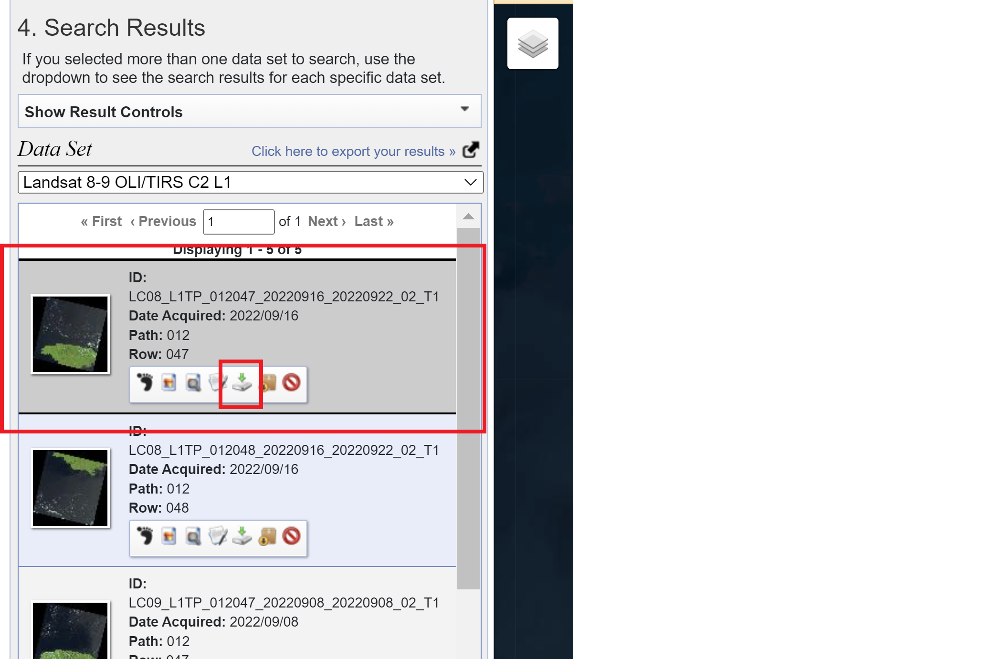
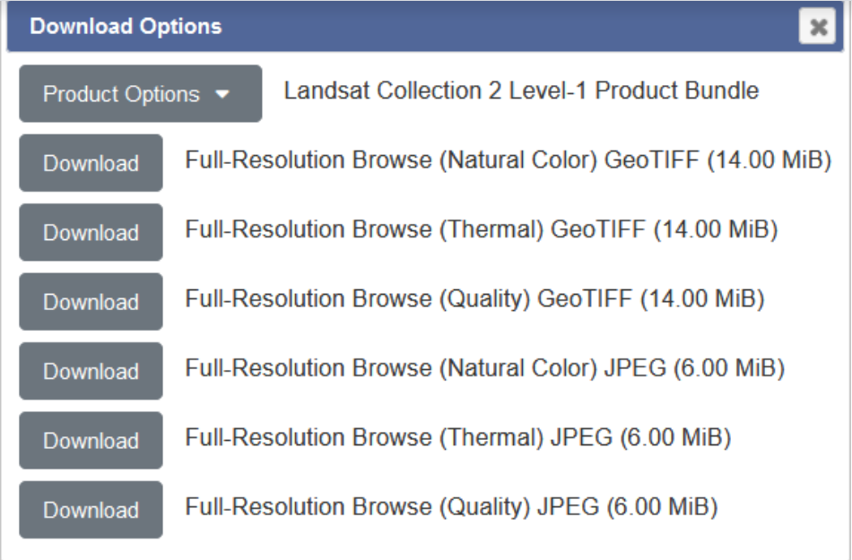

## Copernicus Open Access Hub
**What is Open Access Hub?** The Copernicus Open Access Hub is a free and open-source platform for accessing any of the European Space Agency’s Sentinel data products. Users can choose between a graphical user interface (GUI) or an application programming interface to interact with and download data based on their project needs. Documentation for use of each of the products, as well as a user guide for the Hub itself, is also available on the Hub’s website. 

### Exercise 1.2. Practice using Copernicus Open Access Hub.
This exercise will demonstrate how to use Copernicus Open Access Hub to locate and download Sentinel-2 scenes for a particular date range and area of interest. For this lesson, our area of interest is the **western coast of Jamaica** and the date range is **September 1, 2022 to September 16, 2022**.

1. Navigate to the Copernicus Open Access Hub home page: [https://scihub.copernicus.eu/](https://scihub.copernicus.eu/)
2. Select the “Open Hub” button to use the GUI option to browse the available data. It is also accessible via this link: [https://scihub.copernicus.eu/dhus/#/home](https://scihub.copernicus.eu/dhus/#/home)
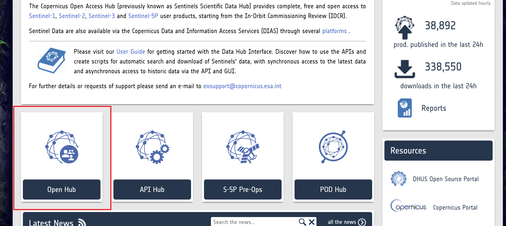

3. Login to your account by clicking on the icon of a person with a question mark.
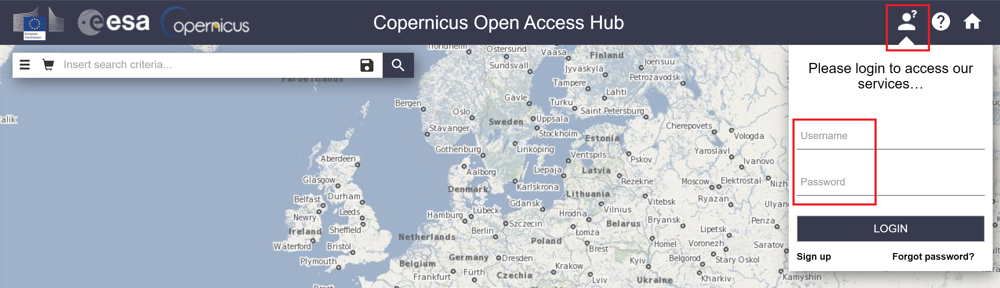

4. You can search for data products using one of two ways: the first is text search, which you use if you know the ID for your desired image, and the second is advanced search, which you can use to narrow down products based on a set of criteria. The tutorial will follow the steps for advanced search.
5. Using your cursor, drag the map and zoom in to the western coast of Jamaica. 
6. Right-click and drag your mouse over the area of interest to draw a rectangle around the area of interest. 
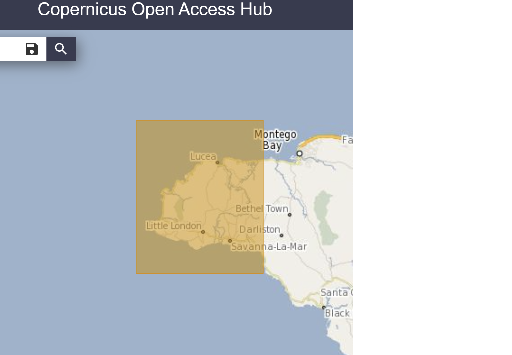

7. Click on the 3 horizontally stacked bars on the left hand side of the search bar to open up the Advanced Search menu.
8. Input the following parameters into the Advanced Search box:
    1. **Sensing period:** 2022/09/01 to 2022/09/21
    2. **Mission:** Sentinel-2 (You may need to scroll down to select that box.)
    3. Below the checked Sentinel-2 Mission box:
        1. **Satellite Platform:** `S2B_*`
        2. **Product Type:** `S2MSI2A` (Corresponds to Sentinel-2 MSI Level 2A.)
        3. **Cloud Cover %:** `[0 TO 30]`
9. Press the magnifying glass icon on the right hand side of the search bar to search for the corresponding data products.
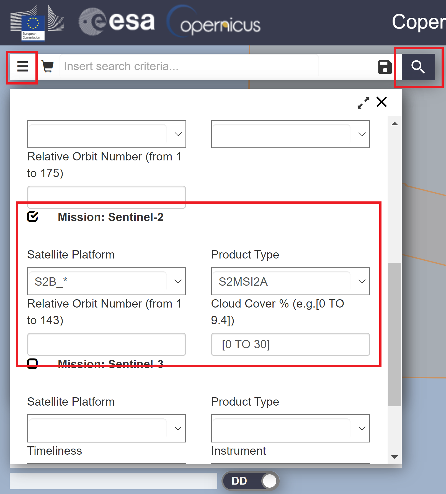

10. You can select the eye icon to inspect details about the image tile, or press the downward arrow to download the image.
    1. All the data you need has already been downloaded for you, so you do not need to download the images. 
    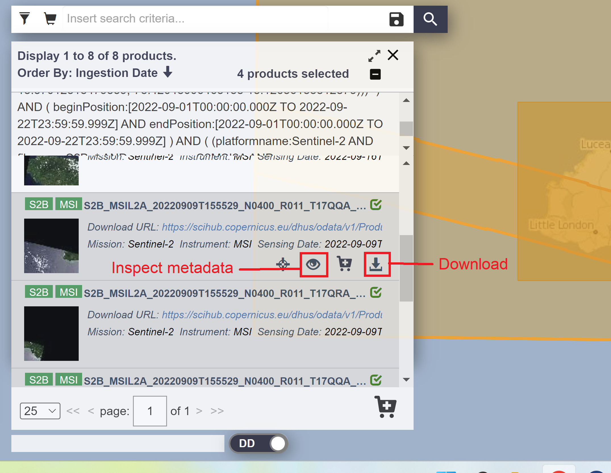
