# Data Visualization with Landsat

Remote sensing data is useful for gaining insights about a particular region by extracting the values stored in image bands and combining them to calculate different types of indices. Perhaps even more powerful, however, is the ability to use imagery to visualize those calculations. This lesson will use Landsat data to calculate different vegetation health indicators and review how to properly visualize those results. 

## Objectives

1. Understand and implement the required pre-processing steps for Landsat data. 
2. Experiment with common band combinations for visualizing remote sensing data.
3. Calculate NDVI with band math using Landsat data products.
4. Gain strategies for creating visually effective and useful image products.

## Image Pre-processing
Before remote sensing imagery can be used for analysis, it must go through a number of correction steps to ensure the data is as accurate as possible for a user’s research project. A number of these steps are often carried out by the organization that provides the data before it is released:

1. **Geometric correction.** This process aligns data layers to both their correct geographic location as well as relative to each other.
2. **Solar correction.** This process adjusts pixel values to account for solar effects. The resulting imagery consists of top-of-atmosphere reflectance values.
3. **Atmospheric correction.** This process counteracts the effects of the atmosphere on the energy measurements taken by the sensor. Some of these effects include scattering and absorption.
4. **Topographic correction.** This process accounts for reflectance variations due to slope, elevation, and aspect. It is especially important for areas with rugged or mountainous terrain. 

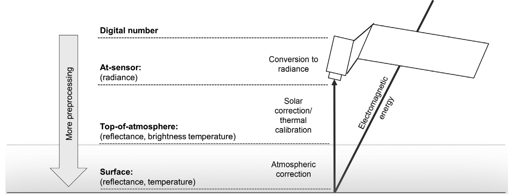

Figure 6. Pre-processing levels for remote sensing data. Image source: Young et. al., 2017

The level of pre-processing that a user needs depends on the type of analysis being carried out. Pre-processing does impact the values, and thus the analysis results, of the data being used and has the potential to introduce additional errors into a study. It is important to use remote sensing data with the appropriate amount of pre-processing to carry out the most accurate and consistent analysis as possible. 

### Exercise 2.1 Examine differences between data products.
This exercise will underline the differences between surface reflectance (SR) and top-of-atmosphere (TOA) Landsat 8 data products.

1. Open QGIS.
2. Under “Project Templates,” select “New Empty Project.”
3. Once the project opens, select “Project > Save As…” and save your project as `intro-remote-sensing`.
4. Once the project saves, select “Layer > Add Layer > Add Raster Layer…”
5. First, add the SR image. Click on the `...` next to the “Raster dataset(s)” field. Navigate to the `intro-rs-data` folder and double-click on `l8-sr-negril-example.tif`.
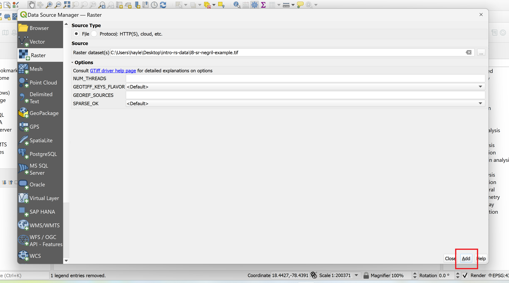

6. Press “Add”, close the window, and then save the project.
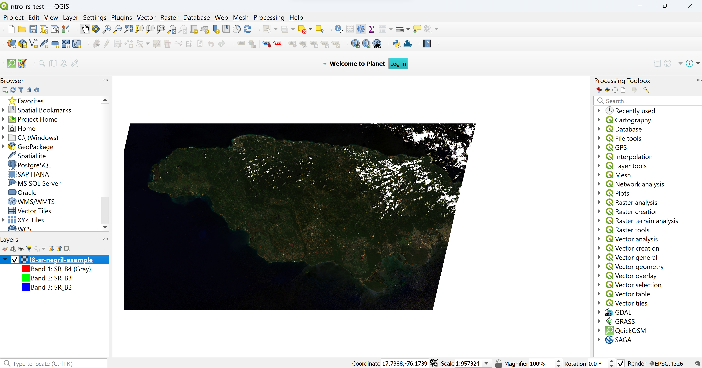

7. The image looks a little dark, so you need to do some enhancements. Right-click on the layer name and select “Properties… > Symbology.”
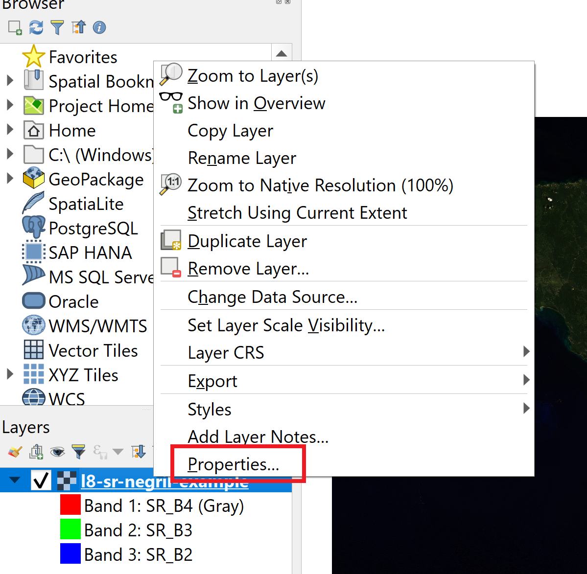

8. Expand the “Min/Max Value Settings” section. Select the “Cumulative count cut” option and adjust the values to 3.0 and 97.0. In the “Statistics Extent” field, select the “Whole raster” option.
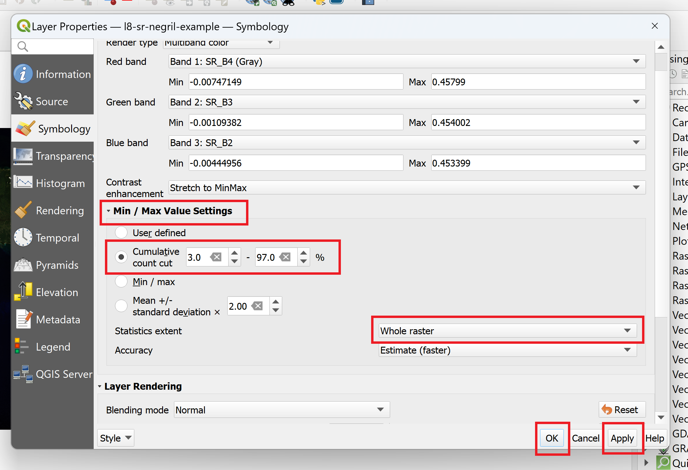

9. Press “Apply” and close the window. Save the project.
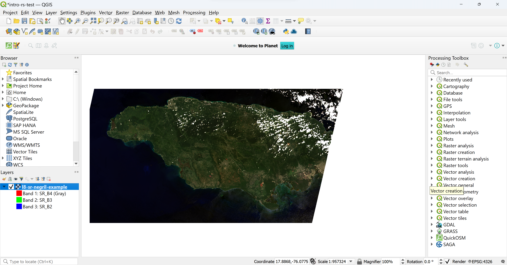

10. Next, add the TOA image. Repeat steps 4-9, but use “l8-toa-negril-example.tif” instead of the “l8-sr-negril-example.tif” file in step 5.
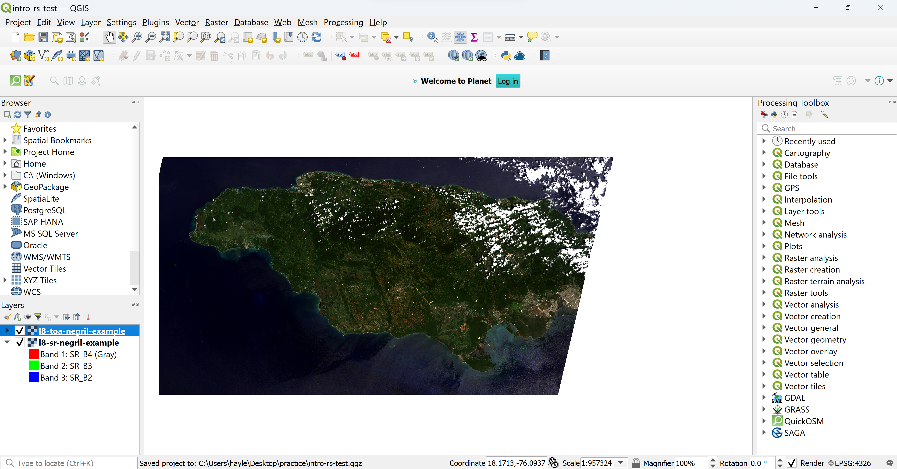

Examine the differences between the two images. Notice how the SR image appears brighter and somewhat clearer than the TOA image due to the additional corrective steps taken to create the surface reflectance product. It is generally recommended that researchers use TOA imagery for single-date, single-scene analysis and SR imagery for multi-date or larger geographical scale analysis. We will use SR imagery for the remainder of the lesson.

**Cloud cover**. Oftentimes, particularly in coastal or tropical regions, an image will contain clouds that need to be removed before the data can be analyzed. The images used in Exercise 2.1 contain such cloud cover. While much of the required pre-processing is already completed with SR products, cloud removal, or cloud masking, must be carried out by the user.

### Exercise 2.2 Create a cloud-free true color image.

This exercise will walk through how to create a true color composite image using Landsat 8 bands and remove clouds from the image using the Cloud Masking plugin. Check the link just to see some of the L8 spectral specifications [https://www.usgs.gov/landsat-missions/landsat-8](https://www.usgs.gov/landsat-missions/landsat-8)

1. Open QGIS.
2. Under “Recent Projects,” select `intro-to-remote-sensing` and open it.
3. **Create a true color image**. This is the same process that was used to create the premade true color images used in Exercise 2.1.
    1. Select “Raster > Miscellaneous > Merge…”
    2. Click on the “...” next to the “Input layers” field.
    3. Click on “Add File(s)...” and navigate to “intro-rs-data > l8-sr-negril-2022-09-16”. Hold down on the Shift key on your keyboard and select the files ending in “B4”, “B3”, and “B2”. Click on “Open” to add the files.
    4. In the “Input layers” window, make sure that the bands are ordered correctly. True color images are made by combining the red band (Landsat 8 Band 4), green band (Landsat 8 Band 3), and blue band (Landsat 8 Band 2) of an image into one single image in that particular order. Drag and drop the file names so that B4 file is listed first, followed by the B3 file, and then the B2 file. Press “OK” to return to the “Merge” window.
    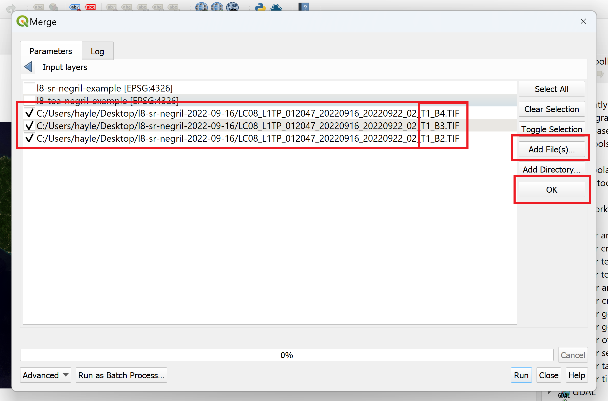

    5. Under the “Input layers…” field, check the “Place each input file into a separate band” option to create one composite image.
    6. Finally, next to the “Merged” field, select the “... > Save to File…” to specify where you want the image saved. Save the image in “intro-rs-data > outputs” and input “l8-sr-tc-negril” as the file name. Press “Save.”
    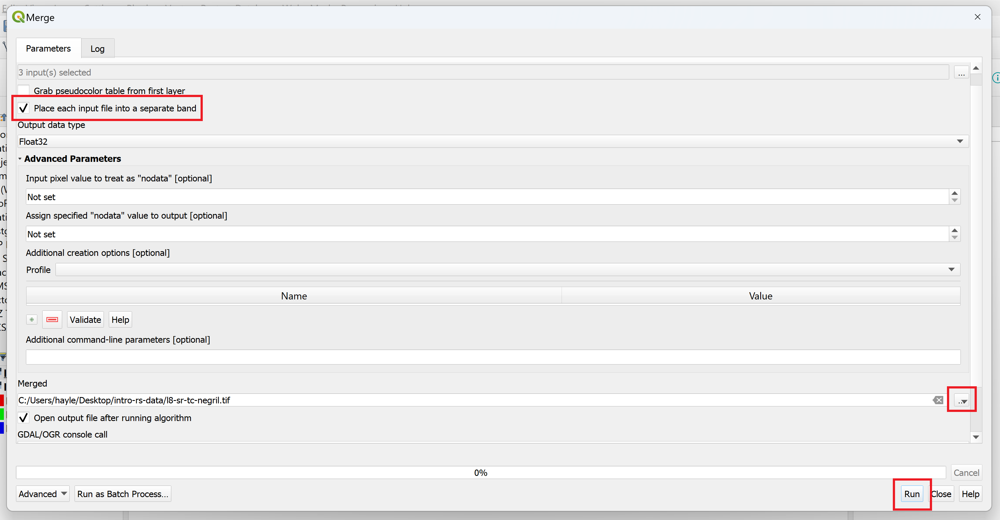
    7. Press “Run” to create and load the image onto the canvas and click “Close” to close the “Merge” window.
    
4. **Mask out clouds**. We will use Cloud Masking, a helpful QGIS plugin that masks clouds for Landsat data, to carry out this process.
    1. Go to “Plugins > Cloud masking for Landsat products > Cloud Masking.” A panel should appear on the right hand side.  
    2. In the “Open and Load” tab, click on “Browse” next to the “Landsat Metadata File” field. Navigate to “intro-rs-data > l8-sr-negril-2022-09-16” and select the file ending in “MTL”. Press “Open” to add it, and then click on the “Load” button. The metadata file should automatically be selected.
    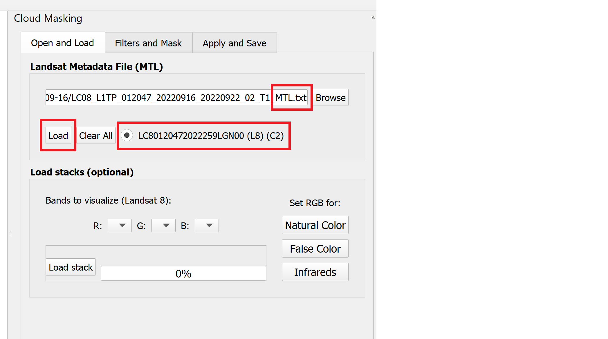
    3. Under the “Load stacks” field, click on the “Natural Color” button to set the band arrangement as a true color image. 
    4. Next, select the “Filters and Mask” tab. Under the “Filters to apply” field, select the “FMask” option. Leave all the options as is.
    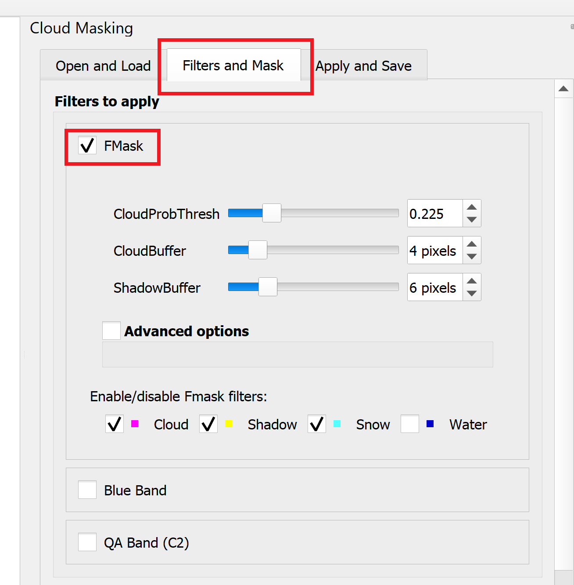
    5. **Make sure you save your project before doing this step**. Click on “Generate Mask.” It may take a couple minutes. When it has finished, a new cloud mask layer should appear on the canvas. If the mask doesn’t look right, you can adjust the parameters in the “FMask” field and generate a new mask until you are satisfied with the result. Save the project again.
    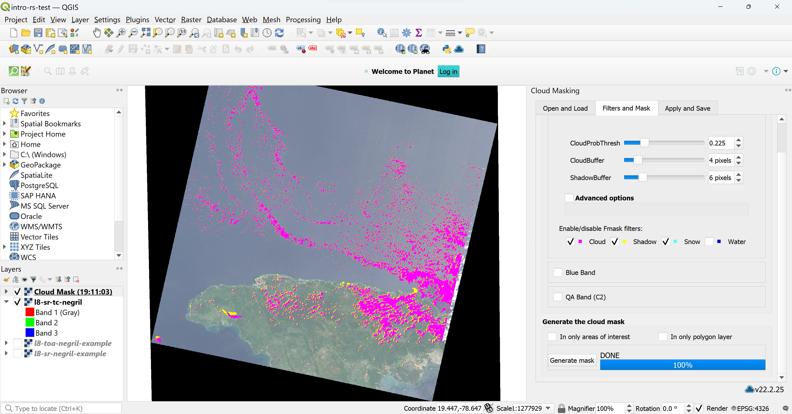
    6. Click on the “Apply and Save” tab. Next to the “Select output file for save result” tab, click on “...”.
    7. Save the file in “intro-rs-data > outputs” and name it “l8-sr-tc-negril-cloudmasked.” Press Save.
    8. Click “Apply mask.” It may take a couple minutes to run.
    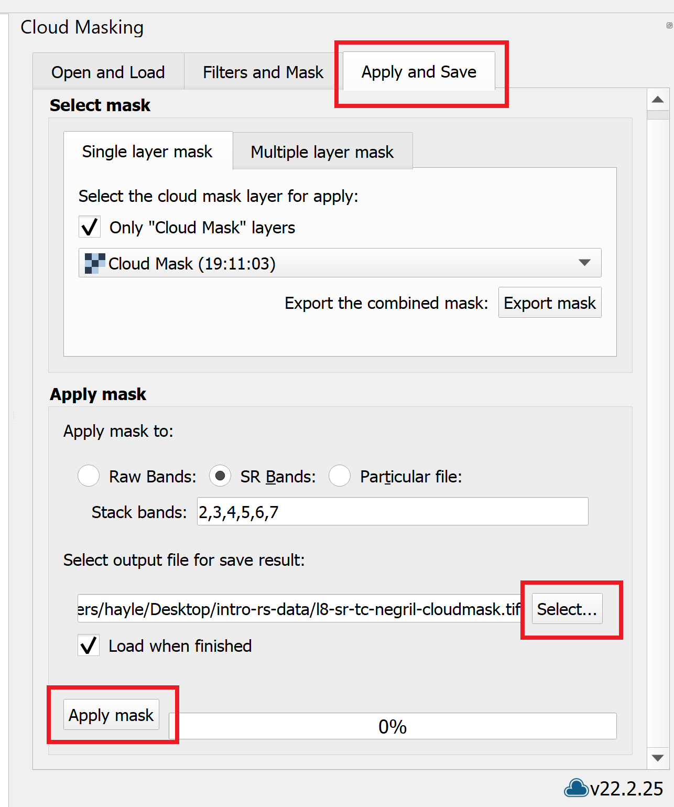
5. Repeat steps 7-9 from Exercise 2.1 to enhance the image, but adjust the “Cumulative count cut” values to **1.0** and **99.0**. You may need to lower the gamma value as well. Save the project.
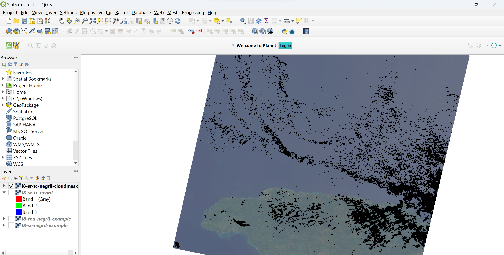

Now we have a cloud-free, Landsat 8 surface reflectance image! Obviously there are some significant gaps where the clouds were present, so it’s usually best to mask out clouds and create a cloud-image composite over a particular season, or try to use images that have less than 30% (or a threshold of your choice) cloud cover to minimize the amount of data removal. Cloud masking is not a perfect science – sometimes you need to test out a number of different algorithms to find the one that best suits your data and study area.

## Vegetation Analysis: Part 1

Step 4.c. in Exercise 2.2 showed how combining bands in one particular order allows a user to visualize a Landsat 8 scene as it would appear to the human eye (true color image). The other bands in an image can also be combined to illustrate particular characteristics about a region. In the next few sections, we will attempt to answer the following question: **How does vegetation cover differ between protected and non-protected areas?** This lesson will focus on the Negril Environmental Protection Area on the western coast of Jamaica.

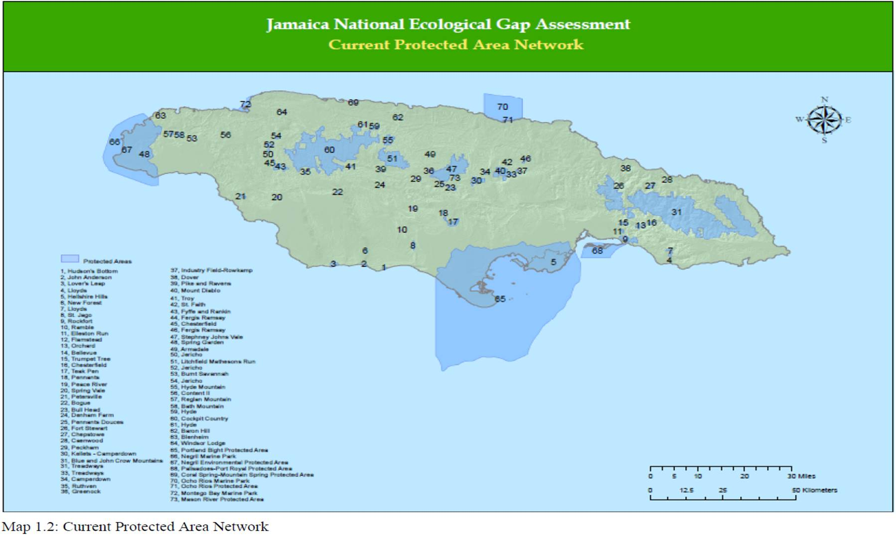

One method for inspecting vegetation cover in an area of interest is to create a type of false color composite called a **near-infrared**, also referred to as **color infrared**, image. Healthy vegetation tends to reflect high levels of near-infrared (NIR) energy. By arranging the NIR, red, and green bands into a single image, it is easy to see the general distribution and health of the plants in a given space. 

### Exercise 2.3 Visualize vegetation with color infrared imagery

This exercise will illustrate how to create a color infrared composite image using Landsat 8 to examine the vegetation cover in western Jamaica.

1. Open QGIS.
2. Under “Recent Projects,” select “intro-remote-sensing” and open it.
3. Select “Raster > Miscellaneous > Merge…” 
4. Click on the “...” next to the “Input layers” field. 
5. Click on “Add File(s)...” and navigate to “intro-rs-data > l8-sr-negril-2022-09-16”. Select the files ending in “B5”, “B4”, and “B3”. Click on “Open” to add the files.
6. In the “Input layers” window, make sure that the bands are **ordered correctly**. Color infrared images are made by combining the NIR band (Landsat 8 Band 5), red band (Landsat 8 Band 4), and green band (Landsat 8 Band 3) of an image into one single image in that particular order. Drag and drop the file names so that “B5” file is first, followed by “B4”, and then “B3”. Press “OK” to return to the “Merge” window.
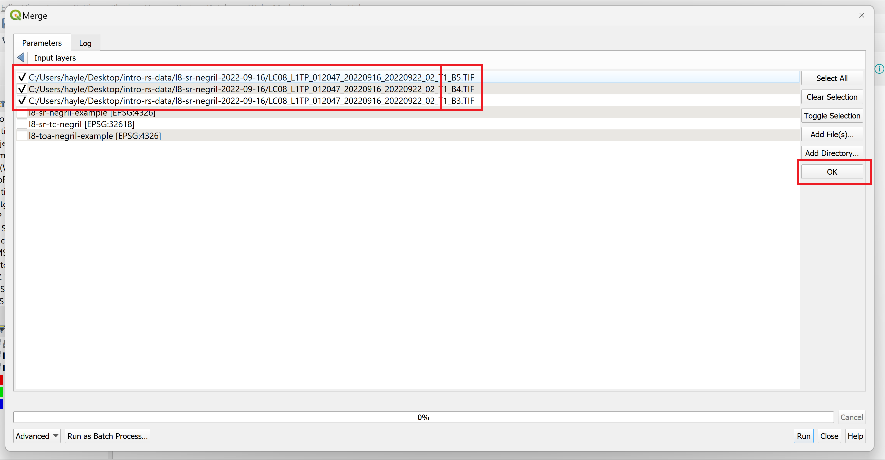

7. Under the “Input layers…” field, check the “Place each input file into a separate band” option to create one composite image.
8. Finally, next to the “Merged” field, select the “... > Save to File…” to specify where you want the image saved. Save the image in `outputs` and input `l8-sr-nir-negril-2022-09-16` as the file name. Press “Save.”
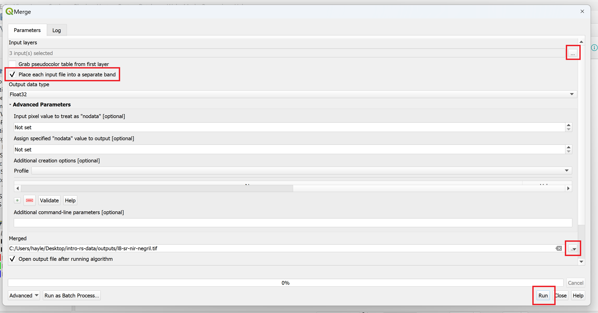

9. Press “Run” to create and load the image onto the canvas and click “Close” to close the “Merge” window.

Toggle the near-infrared layer on and off to compare the false color composite to the true color composite. Areas with dense, green vegetation should appear bright red, while non-productive or non-vegetated areas should appear somewhere between a brown to a white-ish blue color. The false color composite makes it much easier to quickly identify highly productive, vegetated areas.

**Band math**. The true color and color infrared visualizations did not require any calculations. Instead, the bands could be arranged in a particular order to make the image appear differently. This [website](https://gisgeography.com/landsat-8-bands-combinations/) provides a reference for other common band combinations for Landsat 8 data visualization. More complex analysis requires more than a rearrangement of bands – oftentimes, bands must be combined using an equation whose output is stored in a new band and corresponds to some sort of analysis metric. 

One of the most common indices for visualizing vegetation in an image is the Normalized Difference Vegetation Index (NDVI). NDVI is calculated using the following equation:

$NDVI = {NIR - Red \over NIR + Red}$

The NIR band corresponds to Band 5 and the red band corresponds to Band 4 in Landsat 8/9 imagery. NDVI output values range between -1 and +1, where values closer to -1 indicate water and values closer to +1 indicate dense, green vegetation. Since vegetation reflects near infrared wavelengths and absorbs red light, this indicator can be very effective at highlighting vegetation cover and denoting agricultural zones, forest extent, and areas of drought, among other applications.

### Exercise 2.4 Calculate NDVI using Landsat 8

This exercise provides a step-by-step process for creating and displaying a new, single-band image of NDVI values for the western coast of Jamaica using Landsat 8 data products.

1. Open QGIS.
2. Under “Recent Projects,” select “intro-remote-sensing” and open it.
3. Click on “Layer > Add Layer > Add Raster Layer…” and click on “...” next to the “Raster dataset(s)” field to browse and select a file.
4. Navigate to “intro-rs-data > l8-sr-negril-2022-09-16 ” and select the files ending in “B5” and “B4”. Click on the “Open” button and then click on “Add” to add the layer to the canvas.
5. We will use the formula in the section above to create a new, single-band image showing the NDVI values for the region. Select “Processing > Toolbox” to open the QGIS toolbox.
6. Either type in “Raster calculator” in the search box or navigate to “Raster analysis > Raster calculator” and double-click to open the tool.

7. In the calculator, you can either write your own expression or use a predefined expression. NDVI is predefined in QGIS, but for the sake of practice, we will write our own expression. In the “Expression” field, copy and paste the following text: **(NIR - Red) / (NIR + Red)**
8. Now, highlight the first instance where it says “NIR” and double-click on `LC08_L1TP_012047_20220916_20220922_02_T1_B5@1` to replace it with the actual image band. Repeat for the other instance of “NIR.”
9. Next, highlight the first instance where it says “Red” and double-click on `LC08_L1TP_012047_20220916_20220922_02_T1_B4@1` to replace it with the actual image band. Repeat for the other instance of “Red.”
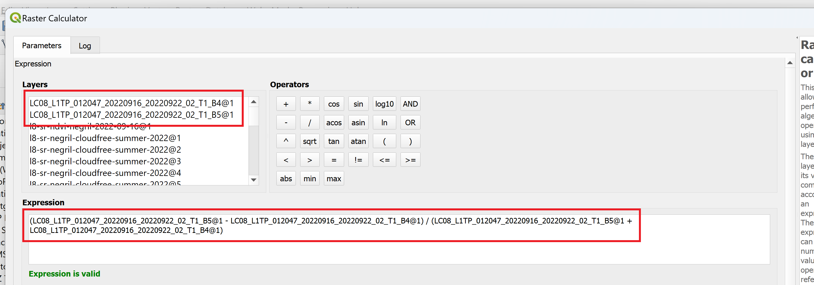

10. Scroll down to the “Reference layer(s)” field. Click on “...” and check the box next to either the B5 band or the B4 band. Click “OK.”
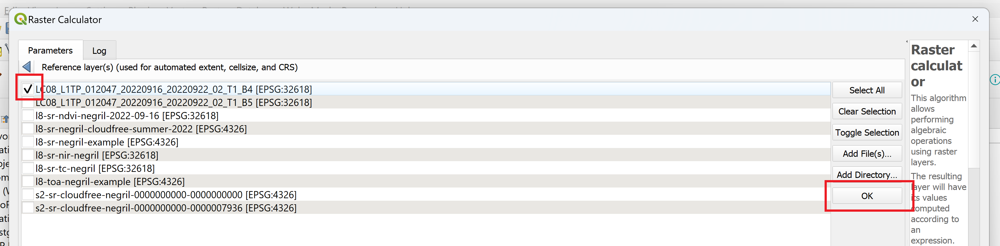

11. Click on “... > Save to File…” next to the “Output” field. Save the file in the `outputs` directory, name the file `l8-sr-ndvi-negril-2022-09-16`, and click on “Save.”
12. Click “Run.” Once the process has finished running, click “Close” to close the window. Save the project.

An image with the NDVI values of the entire raster has now been added to the canvas! Since it is a single-band image, it automatically shows up in greyscale. Most parameters, however, are far more valuable if they are depicted in color so the data can tell an impactful story.

**The golden rules of data visualization.** The way data is presented can be just as important as the way it was generated. If your audience can’t ascertain any meaning from your data, it’s unlikely that actionable decisions will result from it and it may be left in the archives to gather dust. Visuals often impart meaning more powerfully than words, underscoring the importance of creating thoughtful data visualizations. The process of making these visualizations is an excellent chance for creativity – the way data should be shown often depends on the context of the project and the data itself, but the following tips and tricks will give you some general guidelines to consider as you explore different techniques and color palettes.

1. **Begin with a goal**. Starting with a goal provides the foundation to bring together ingredients of data visualization with a purpose.
2. **Know your data**. While almost anything can be turned into data and encoded visually, knowing the context behind data is as important as understanding the data itself. This knowledge will also serve to verify that you have the best data to support your goal.
3. **Put your audience first**. Data visualization is rarely one size fits all, and its message can be lost if it’s not customized for its audience. Thus, focus on visualizing what your audience needs to know.
4. **Be media sensitive**. Considering how the visualization will be viewed will help you make sure your visualization reaches its audience.
5. **Choose the right chart**. Know the strengths of each chart type and what key features of data they best visualize.
6. **Chart smart**. The ability for a visualization to lead its audience to answers can also occasionally lead to the wrong answers. Data visualizations should not distort, mislead, or misrepresent.
7. **Use labels wisely**. Give your audience context by including a simple and compelling title. Then, label axes so that they are easy to read and appropriate to the data they display. Minimize the use of legends.
8. **Design to the point**. Over-designing makes important information harder to find, harder to remember, and easier to dismiss. The key to designing data visualizations is to be straightforward.
9. **Let the data speak**. The most important component of data visualization is the data. Use visual cues strategically to guide the audience and draw their attention, but let the data tell the story, not the design.
10. **Feedback is a good thing**. Take time to fine-tune visualizations by engaging with stakeholders to gather feedback.

*Source: [Database: Trends and Applications](https://www.dbta.com).*

### Exercise 2.5 Customize the NDVI layer

This exercise explores how to choose and customize a color palette to more easily visualize the NDVI image created in Exercise 2.4.

1. Open QGIS.
2. Under “Recent Projects,” select “intro-remote-sensing” and open it.
3. Right-click on “l8-sr-ndvi-negril-2022-09-16” and select “Properties…”.
4. Select the “Symbology” tab on the left hand side of the pop-up window.
5. Next to the “Render type” field, select “Singleband pseudocolor” from the drop down menu.
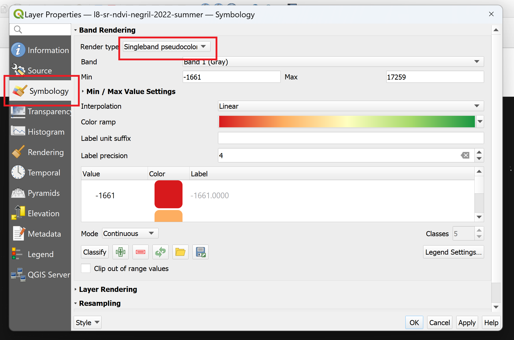

6. Next to the “Color ramp” field, choose one of the following options:
    1. Use a preset color ramp.
        1. Hover over “All Color Ramps” and select one of the premade color ramps. “RdYlGn” is a common choice for NDVI, where red indicates low NDVI values and green indicates high NDVI values.
        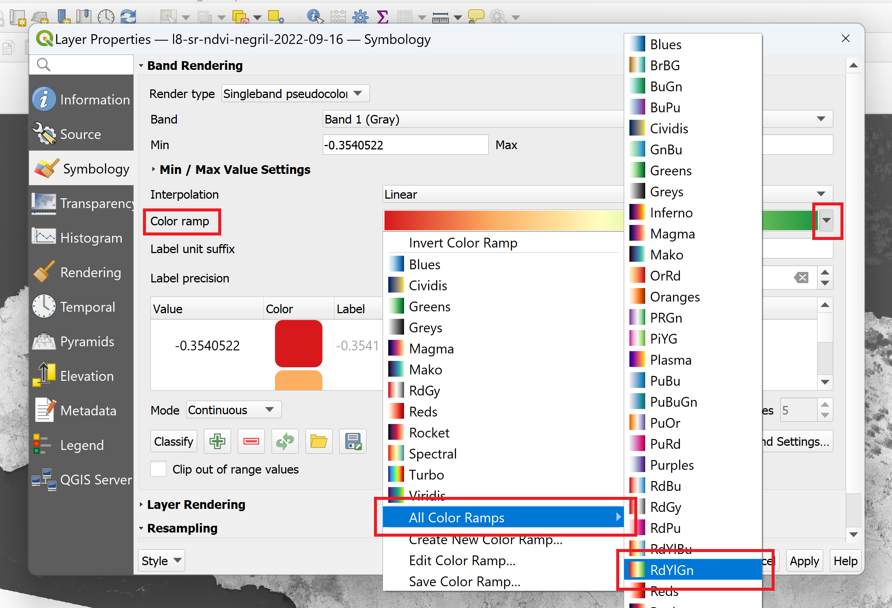

    2. Create a custom color ramp.
        1. Select the “Create New Color Ramp…” option. Choose the “Gradient” option and click “OK.”
        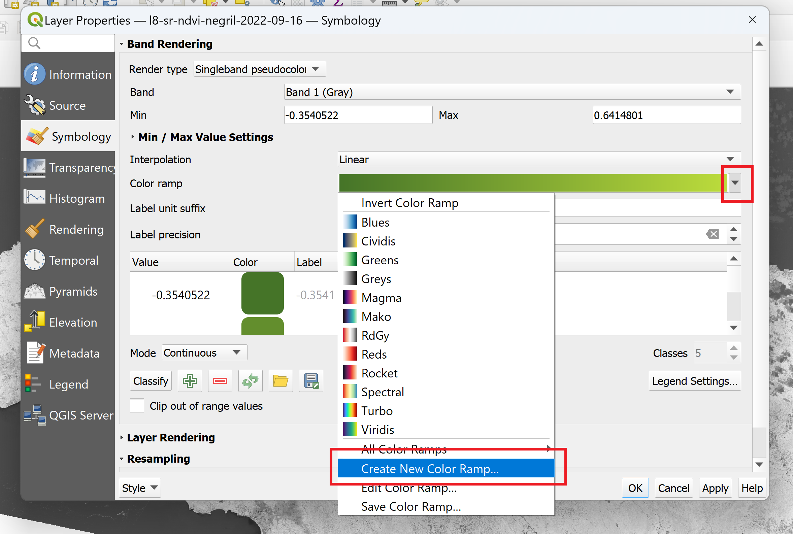

        2. Experiment with different color combinations. Note that the color chosen for “Color 1” will correspond to the minimum NDVI values, and “Color 2” will correspond to the maximum NDVI values.
        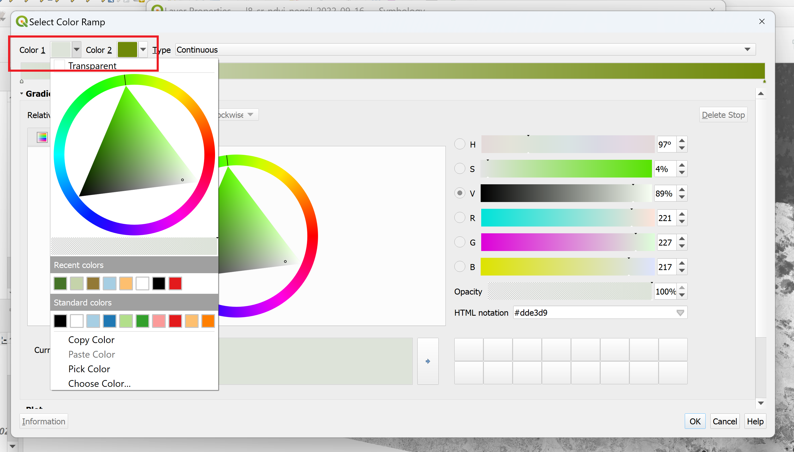

        3. If you want to add additional colors, double-click on the gradient bar in the position where you would like to add those colors.
        4. Click “OK.”
7. Click “Apply.” If you like how the image appears, click “OK” to close the window. Save the project.

*NDVI with RedYlGrn color ramp and min/max adjusted to -1 and 1, respectively.*

This image is much easier to interpret compared to the grayscale image. Depending on the color palette you chose, highly vegetated areas (high NDVI values) appear greener in color, while non-vegetated areas and bodies of water (low NDVI) appear redder in color. Compare the protected areas to the non-protected areas. Do they appear to have different vegetation characteristics?

### Challenge 1: Quantify Landsat 8-derived NDVI

Visual inspection is helpful for telling a story with data, but numbers can tell a story too. Use QGIS to find the mean and median NDVI value inside the Negril Environmental Protected Area and in the non-protected areas of western Jamaica. Compare the values to see if there is a difference in vegetation levels between protected and non-protected areas.
* *Hint 1: You will have to use the `l8-sr-ndvi-negril-2022-09-16.tif` as well as `negril_pa_shapefile_NoSea.shp` and `non_protectedArea_savanna.shp` in the project.*
* *Hint 2: The Zonal Statistics tool will come in handy in this exercise. Look for the Processing ToolBox→ Raster Analysis → Zonal statistics tool. You will be able to specify the statistics that you want (mean, max, min, etc)... then the results will be added in the attribute table of the shapefile layer used.*

### Challenge 2: Calculate Landsat 8-derived NDWI

The Normalized Difference Water Index (NDWI) is a well-known measure to estimate water content on the Earth Surface.  Use a similar process as we did for the NDVI exercise in order to obtain NDWI values.
