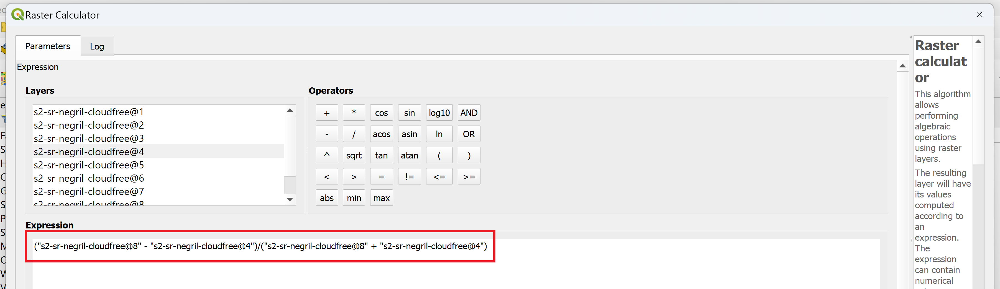

# Data Visualization with Sentinel-2

Landsat data is most useful for its long temporal range. Data collection for the Landsat missions started in 1972, though most researchers use data from Landsat 5 and onward, which started in 1984. The temporal and spatial resolution of Landsat data products, however, fall more in the moderate range. Though the range of data collection is not as long, Sentinel-2 data has a higher spatial and temporal resolution and is also freely available. This lesson will examine the differences between Landsat and Sentinel-2 data and how vegetation analysis using Sentinel-2 data products compares to Landsat 8 products.

## Objetives

1. Understand the factors to consider when selecting remote sensing data to use for a research project.
2. Note the differences between Landsat and Sentinel-2 data products.
3. Calculate NDVI using Sentinel-2 data products.

## Data Selection

Many different types of remote sensing data sources and products exist. Selecting the right products can be challenging, so understanding what aspects to consider in the selection process is highly important. Consider the following points in the context of your research question when selecting the right type of remote sensing data.

1. **Spatial resolution**. Consider the size of the feature you are interested in studying. If you’re attempting to classify the land cover of a country, high spatial resolution is not necessary and could even hinder the classification process. If the spatial resolution is so high that individual objects such as trees are made up of multiple pixels, each pixel will likely appear differently. In this example, when you define the forest class for your land cover analysis, you would have to consider the differences in shading, color, or age of the pixels that make up the trees rather than having consistency across larger-sized pixels. On the other hand, if you are inspecting crop cover on small farms, a higher resolution may be necessary.
2. **Temporal resolution and extent**. Consider how frequently you need new data. For a daily monitoring project, a product with high temporal resolution would be necessary. For a seasonal study, where all the images may be averaged into one image for each season, lower temporal resolution could be acceptable. Temporal extent, or how far back the data goes, matters depending on the length of your study. For historical analyses, data sets with large temporal extents would be appropriate.
3. **Spectral resolution**. Many sensors only measure energy and store the data in a limited number of bands. Hyperspectral satellites gather data with a greater amount of spectral detail and can thus discern a higher number of attributes in a region. These datasets, however, can be more challenging to process and are less commonly used so it could be difficult to find and implement methodology to answer your research question.
4. **Data availability and associated products**. The amount of available data, its ease of access, and level of pre-processing all depend on the data provider. Some datasets, like Landsat and Sentinel-2, are freely available and you can acquire imagery with varied levels of pre-processing. Other datasets may cost money to access or undergo limited pre-processing. Additionally, some providers will generate products using sensor data that could be useful, such as rasters that look at chlorophyll-a levels or gross primary productivity. 
5. **Application**. Consider the topic of your research project. Different types of data are better suited for different types of analysis. Change detection, for instance, most often uses optical imagery, while canopy height measurements are best calculated using lidar data. Familiarizing yourself with the literature for your topic to see what types of data are commonly used is a helpful place to start.

Do not assume that the data product with the highest spatial, temporal, and spectral resolution is always the best choice. With an increase in resolution comes an increase in the amount of data that needs to be processed. The computational power required to analyze this type of data and the storage capacity to hold this amount of data can act as major limiting factors – make sure you weigh the costs and benefits of each data type and select the one that fits your project best.

## Vegetation Analysis: Part 2

Let’s return to the research question proposed in the Vegetation Analysis: [Part 1](data-viz-landsat.md) section of Data Visualization with Landsat: **How does vegetation cover differ between protected and non-protected areas?** To fully answer this question, we will carry out the same NDVI analysis that we did in Part 1, but this time using Sentinel-2 data.

First, note the differences between Landsat 9 and Sentinel-2 data within the data selection framework laid out in the section above:

| **Selection Feature** | **Landsat**                                                                       | **Sentinel-2**                                            |
|-----------------------|-----------------------------------------------------------------------------------|-----------------------------------------------------------|
| Spatial resolution    | 30 meters                                                                         | 10 meters                                                 |
| Temporal resolution   | 16 days (or 8 days combined)                                                      | 5 days                                                    |
| Temporal extent       | 1984 - present                                                                    | 2015 - present                                            |
| Data availability     | Freely available; many different processing levels and science products available | Freely available; 3 different processing levels available |
| Application           | Optical data applications                                                         | Optical data applications                                 |

The primary differences between the two satellites lay in the spatial and temporal resolution and temporal extent. Let’s examine if these factors make a difference in evaluating our vegetation research question.

### Exercise 3.1 Calculate NDVI using Sentinel-2

This exercise provides a step-by-step process for creating and displaying a new, single-band image of NDVI values for Negril using Sentinel-2 data products.

1. Open QGIS.
2. Under “Recent Projects,” select “intro-remote-sensing” and open it.
3. Click on “Layer > Add Layer > Add Raster Layer…” and click on “...” next to the “Raster dataset(s)” field to browse and select a file. 
4. Navigate to select the “s2-sr-negril-cloudfree.tif” file. Click on the “Open” button and then click on “Add” to add the layer to the canvas. 
5. We will use the NDVI formula to create a new, single-band image showing the NDVI values for the region. Select “Processing > Toolbox” to open the QGIS toolbox. 
6. Either type in “Raster calculator” in the search box or navigate to “Raster analysis > Raster calculator” and double-click to open the tool. 
7. In the calculator, you can either write your own expression or use a predefined expression. In the “Expression” field, copy and paste the following text: (NIR - Red) / (NIR + Red)
8. Now, highlight the first instance where it says “NIR” and double-click on “s2-sr-negril-cloudfree@8” to replace it with the actual image band. Repeat for the other instance of “NIR.”
9. Next, highlight the first instance where it says “Red” and double-click on “s2-sr-negril-cloudfree@4” to replace it with the actual image band. Repeat for the other instance of “Red.”

10. Scroll down to the “Reference layer(s)” field. Click on “...” and check “s2-sr-negril-cloudfree-ndvi”. Click “OK.”
11. Click on “... > Save to File…” next to the “Output” field. Save the file to the `outputs` directory, name the file `s2-sr-ndvi-negril`, and click on `Save`.
12. Click “Run.” Once the process has finished running, click “Close” to close the window. Save the project.

13. Customize the layer using the same color ramp you chose in Exercise 2.5. Save the project.

Toggle the Sentinel-2 and Landsat 8 NDVI layers on and off. How do these results differ? Which data set would be best to use to answer the research question (if it even makes a difference)? There is no perfect way to determine the best data set to use for any given project – sometimes it takes a little experimentation to find the best fit.

### Challenge 3: Quantify Sentinel-2-derived NDVI

Use QGIS to find the mean and median NDVI values inside the protected areas within Negril and in the non-protected areas of Negril. Compare the values to see if there is a difference in vegetation levels between protected and non-protected areas. Do these values differ from the values calculated in Challenge 1?

* *Hint 1: The process is very similar to Challenge 1.*
* *Hint 2: Save your results to an output file for easier comparison.*
