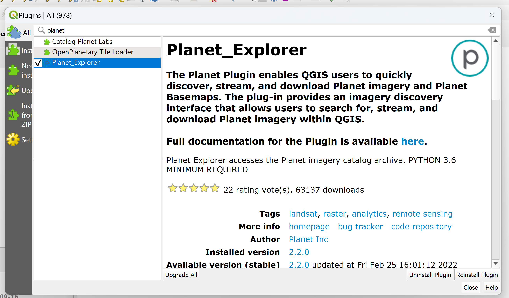

# Working with High Resolution Data
Some analyses require the detection of smaller objects on the ground, or more frequent observations. In these cases, high resolution data is required. High resolution optical data is remote sensing imagery that has either a high spatial or temporal resolution, or both. The commercial availability of this type of data has increased quite a bit over the past few years. This section will focus on one of the most popular providers and data products: Planet’s PlanetScope imagery. 

## Objectives
1. Understand the differences between PlanetScope, Sentinel-2, and Landsat imagery.
2. Identify the effects of projection on remote sensing imagery.
3. Access Planet data in QGIS.
4. Calculate NDVI using Planet NICFI imagery. 

## PlanetScope Imagery
PlanetScope is a constellation of around 130 Dove satellites, Planet’s signature 10 cm x 10 cm x 30 cm lightweight satellite. The immense number of satellites in this constellation allows for daily imaging of the entire Earth at approximately 3 meter spatial resolution. The table below summarizes the key differences between PlanetScope, Landsat 8, and Sentinel-2:

| Satellite | Spatial Resolution | Temporal Resolution | Temporal Extent | Bands | 
| --------- | ------------------ | ------------------- | --------------- | ----- |
| Landsat 8 | 30 m | 16 days | **2013 - present** | Coastal, blue, green, red, NIR, SWIR (x2), panchromatic, cirrus, thermal infrared (x2) |
| Sentinel-2 | 10 m | 5 days | 2015 - present | Coastal, blue, green, red, vegetation red edge (x3), NIR, narrow NIR, water vapor, cirrus, SWIR (x2) |
| PlanetScope | **3 m** | **1 day** | 2016 - present | Coastal, blue, green (x2), yellow, red, red edge, NIR (Some datasets limited to 3- or 4-band images.) |

**Accessing PlanetScope imagery.** One difference not noted in the table is the cost of the data – unlike Sentinel-2 and Landsat 8, most Planet data is not freely available. A subset of its data is freely available, however, through Norway’s International Climate and Forests Initiative (NICFI). Through this partnership, registered users can access high resolution basemaps in tropical regions for zero cost.

**Adding the QGIS plugin.** Planet developed a convenient QGIS plugin that allows anyone with a Planet account to browse, download, or stream data directly to a QGIS project. Find documentation about the plugin on this website’s Resources page. To add the plugin, follow these steps:
1. Open QGIS.
2. Open a recent project or create a new one. 
3. Click on `Plugins > Manage and Install Plugins...`
4. In the search bar, type `Planet_Explorer`.

5. Click `Install Plugin`. 
6. Once the plugin is installed, follow the prompt in the Planet panel of the QGIS project to login to your QGIS account and start browsing the available data.

## Projections
Another difference left out of the table in the previous section is each image set’s default projection. Projected coordinate systems have an impact on remote sensing data and not all datasets use the same default type. Luckily, it is possible to update a dataset’s projection so that all of the datasets follow a consistent system.

### Exercise 4.1 Examining and changing image projections.
This exercise will explore the effect of differing remote sensing data projections and how to change a projection system so that all the data used in a project stays consistent.

1. Open QGIS.
2. Under `Recent Projects`, select `intro-remote-sensing` and open it.
3. Click on `Layer > Add Layer > Add Raster Layer...` and click on `...` next to the `Raster dataset(s)` field to browse and select a file. 
4. Navigate to `intro-rs-data` and select `planet-analytical-monthly-09-2022.tif`. Click on the `Open` button and then click on `Add` to add the layer to the canvas. 
5. **Inspect the image projection.** Toggle the layer on and off. What do you notice? The images don’t seem to be lining up quite right, most likely due to a difference in image projection. Let’s find out.
    1. Right-click on 'l8-sr-tc-negril`. Hover over `Layer CRS`. Note the first item listed in grey – that is the layer’s projected coordinate reference system (CRS).
    2. Now, repeat the process for `planet-analytical-monthly-09-2022`. The listed CRS should be different – but why do the layers align? QGIS automatically reprojects layers based on the project projection so that layers will appear aligned, but they cannot be used for any type of analysis. 
    3. Let’s visualize what it would look like if the layers were not automatically reprojected: right-click on `planet-analytical-monthly-09-2022`. Select `Set to EPSG:32618`. The layers should be completely misaligned!
6. **Update the image projection.** In order to avoid the inconsistencies between data layers, we need to ensure that each layer is projected in the same way. 
    1. Select `planet-analytical-monthly-09-2022`.
    2. Click on `Raster > Projections > Warp (Reproject)...`
    3. Under the `Source CRS` field, select `EPSG:3857`. 
    4. Under the `Target CRS` field, select `EPSG:32618`. 
    5. Next to the `Reprojected` field, click on `...` and navigate to the `outputs` directory. Name the file `planet-analytical-monthly-09-2022-reproj` and press `Save`.
    6. Click `Run`.
7. Now, repeat step 5 with the reprojected layer. Notice that the projections are now the same. Save the project. 

Now these layers can be used for processes such as distance analysis. On-the-fly projection is helpful for visual inspection, but it is important to reproject any data layers that do not match the correct project projection so that analysis can be conducted.

## Vegetation Analysis: Part 3
Let’s revisit our research question one final time: **How does vegetation cover differ between protected and non-protected areas?** Conduct the same NDVI analysis from Parts 1 and 2 using Planet NICFI basemaps, which are created from PlanetScope observations, to see if high resolution imagery gives us more insight to answer the question. 

### Exercise 4.2 Calculate NDVI using Planet NICFI data.
This exercise explains two methods for loading and using Planet data to calculate NDVI for Negril in QGIS.

1. Open QGIS.
2. Under `Recent Projects`, select `intro-remote-sensing` and open it.
3. Choose one of the following methods for calculation:
    1. **Stream NICFI data.** *This option requires an active Planet NICFI account.*
        1. Click on the `Log In` button in the Planet panel of QGIS and sign in with your Planet NICFI account. 
        2. Select the `Basemaps` tab. In the `Select Basemap` box next to the `Name` field, select `PS Tropical Normalized Analytic Monthly Monitoring`.
        3. Check the box next to `September 2022`. 
        4. Click on the `Order` button.
        5. Select the option to `Create Streaming Connection(s)` and click `Next`.
        6. Press `Submit Order`.
        7. The `PS Tropical Analytical Monthly Monitoring - September 2022` should pop up in the `Layers` panel. It could take a minute to load. Press the grey arrow next to the layer name to expand the details below. 
        8. Next to the `Processing:` field, select `ndvi`.
        9. Next to the `Color ramp:` field, select `ndvi` or `rdylgrn`. 
        10. Click `Submit Order`. Save the project.
    2. **Calculate NDVI layer.** *No account required for this option.*
        1. We will use the NDVI formula to create a new, single-band image showing the NDVI values for the region. Select `Processing > Toolbox` to open the QGIS toolbox. 
        2. Either type in `Raster calculator` in the search box or navigate to `Raster analysis > Raster calculator` and double-click to open the tool. 
        3. In the calculator, you can either write your own expression or use a predefined expression. In the `Expression` field, copy and paste the following text: `(NIR - Red) / (NIR + Red)`
        4. Now, highlight the first instance where it says `NIR` and double-click on `planet-analytical-monthly-09-2022@4` to replace it with the actual image band. Repeat for the other instance of `NIR`.
        5. Next, highlight the first instance where it says `Red` and double-click on `planet-analytical-monthly-09-2022@3` to replace it with the actual image band. Repeat for the other instance of `Red`.
        6. Scroll down to the `Reference layer(s)` field. Click on `...` and check either the `planet-analytical-monthly-09-2022@4` or `planet-analytical-monthly-09-2022@3`. Click `OK`.
        7. Click on `... > Save to File...` next to the `Output` field. Save the file in the `outputs` field, name the file `planet-ndvi-09-2022`, and click on `Save.` 
        8. Click `Run`. Once the process has finished running (it may take a few minutes), click `Close` to close the window. Save the project.
        9. Customize the layer using the same color ramp you chose in Exercise 2.5. Save the project.

Now, toggle the layers on and off to compare the NDVI results between Landsat 8, Sentinel-2, and PlanetScope. How do they compare? Does the high resolution data give us additional insight or change our answer to the research question at all?

### Challenge 3: Quantify PlanetScope-derived NDVI.
Use QGIS to find the mean and median NDVI values inside the protected areas within Jamaica and in the non-protected areas of Jamaica. Compare the values to see if there is a difference in vegetation levels between protected and non-protected areas. Do these values differ from the values calculated in Challenges 1 or 2?
* *Hint 1: Follow the same process as Challenge 2 and 3.*

**Congratulations!** You completed the Introduction to Remote Sensing workshop. You can refer back to this material anytime you want throughout the learning series, and don’t forget to look through the Resources section to learn more about the material discussed in this lesson. Before you go, here is one final challenge problem:

### Challenge 4: Conduct analysis on your own study area!
Try out each of the exercises from this lesson on your own study area. If you complete this challenge, share your maps and images with the workshop coordinator to get them featured on the website. 

