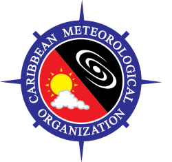

# Partners

## Caribbean Meteorological Organization

The Caribbean Meteorological Organization (CMO) is a specialized agency of the Caribbean Community that coordinates the joint scientific and technical activities in weather, climate and water-related sciences in sixteen English-speaking Caribbean countries: Anguilla, Antigua and Barbuda, Barbados, Belize, British Virgin Islands, Cayman Islands, Dominica, Grenada, Guyana, Jamaica, Montserrat, St. Kitts and Nevis, Saint Lucia, St. Vincent and the Grenadines, Trinidad and Tobago, Turks and Caicos Islands. As weather and climate know no national boundaries, cooperation at a regional and international scale is essential for the development of meteorology and operational hydrology as well as to reap the benefits from their applications. CMO provides the framework for such regional and international cooperation.   

The CMO takes on a number of different roles within the Caribbean Community:
1. It undertakes the **coordination of the joint scientific activities** of the respective National Meteorological Services, the **establishment of joint technical facilities and systems**, the **provision of joint training facilities**, and the **promotion of a reliable severe weather warning system** to safeguard the region. 
2. The CMO provides **support and advice** to governments in the development of their Meteorological and Hydrometeorological Services and in dealing with issues of an international nature affecting weather, water and climate.
3. It represents the regional meteorological community's interests in relation to international civil aviation matters. 
4. It **works closely with regional agencies** involved in disaster preparedness, response and relief. 

For more information about the CMO, please visit their website: [http://www.cmo.org.tt/](http://www.cmo.org.tt/)
