# Running the LandTrendr GUI (2_LT-Data-Visualization)

In the caribbean trainings script repository ([users/kwoodward/caribbean-trainings](https://code.earthengine.google.com/?accept_repo=users/kwoodward/caribbean-trainings)), open the script named **2_LT-Data-Visualization**. When loaded and run, this script creates a LandTrendr-GEE GUI.

**Basic orientation to the GUI**

The LT GUI consists of three panels: A control panel on the left, a reporting panel on the right, and a map panel in the center.

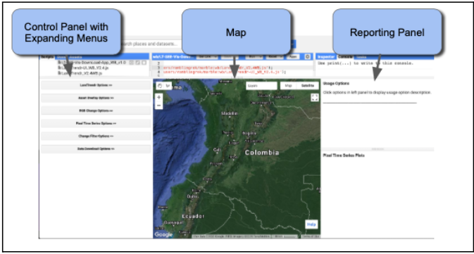

A video showing basic orientation to the GUI is here: [https://youtu.be/tdpuxV7Ad8g](https://youtu.be/tdpuxV7Ad8g).
Using the expanding menus in the Control Panel, the user sets parameters for the LandTrendr runs, displays images and maps in the center panel, or generates charts in the reporting panel. Expanding windows are controlled by clicking on the double-arrows next to each heading:

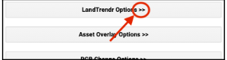

**(OPTIONAL) Explore the point-mode LandTrendr fitting**

The simplest starting way to understand LandTrendr is to apply the algorithms in point mode. This allows you to visualize how fitting works, and how changing your settings can change the fit. To access the point-mode, select the "Pixel Time Series Options" menu. You should see a window something like this:

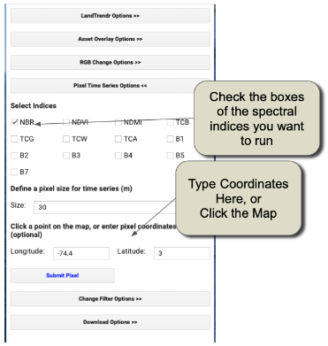

You can either click on a point on the map and wait patiently, or type coordinates and then click on the "Submit Pixel" button. You can view charts for multiple indices at the same point by checking more than one “Select Indices” box. The differences between the different spectral indices are notable, as they respond to vegetation changes differently and some indices are better for detecting change in certain environments than others.
A video showing basic point mode operation is here: [https://youtu.be/RdQvxTbi37E](https://youtu.be/RdQvxTbi37E)
Orient yourself to the layout and meaning of the components of the chart below:

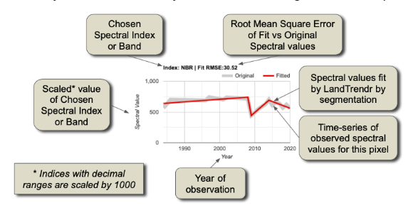

The core interpretation is the difference between the grey line and the red line.
The grey line represents the trajectory of the observed (measured) spectral values for the pixel. The values are extracted from image collections with properties that define the date window and years of the collection.  We refer to these as the "source" spectral values. They bounce around from year to year because of subtle changes in the atmosphere, the timing of image acquisition, etc.

The red line shows what the algorithms decided was the best temporal segmentation through those observed values. This is a function of the fitting parameters of the segmentation model. We refer to these as the "fitted" spectral values.

The goal with these plots is to determine if:
1. The trajectory of the source values captures the processes you believe are occuring at the surface
2. The fitted values adequately capture the overall "shape" of the trajectory of the source values.

**(Optional) Exploring dynamics with three-color composite images**
While the point mode is the only way to fully understand and evaluate the source and fitted values, it is an inefficient way to explore the spatial patterns. We can happen upon pixels where the source values indicate a problem with the imagery, or where the fitting parameters are likely not chosen appropriately, but such findings happen by chance. It would be handy to have a quick visual tool to scan the landscape and evaluate trends and potential problems.

The RGB visualization tool in the LandTrendr GUI is designed to quickly evaluate spatial patterns of spectral fitting by the algorithm. In this tool, we run LT across many pixels, and then show images of the LT-fitted values across pixels, with different years of fitted imagery in the red, green, and blue colors on the screen. With awareness of the years being displayed and the properties of the spectral values being rendered, it is possible to interpret spatial patterns in the RGB images in terms of their land cover change processes, or problems with the imagery or fitting.

First, load a study area for the analysis. The LandTrendr algorithms are computationally intensive and take some time to run. For training purposes, it is useful to constrain our analysis to a relatively small geographic domain.
In the Control Panel, select the "Asset Overlay Options" menu, and enter these values:
1. In the first box, enter the path to your AOI asset, or a smaller sample area.
2. In the first box of the "Define Layer Name" section, enter a name that you will recognize when it appears in the layers of the map.
3. Near the bottom, click the check-box that makes the first layer one to use to constrain later analyses.
4. Click on the 'Add asset to map'.
Next, open the RGB change mapper menu in the GUI. A basic video showing the RGB tool is here: [https://youtu.be/VSeia3NRa3c](https://youtu.be/VSeia3NRa3c)

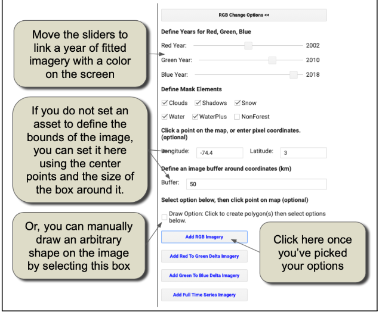

Click on "Add RGB Imagery", and wait patiently. It may take a minute to fully load the area we have chosen.

How do we interpret the colors? Let's assume we are working with an index such as NBR, TCW, or NDVI where high values indicate more vegetation and low values indicate less vegetation.
First, let's consider an area with no colors -- an area that is black, white or some grey tone in between. If an area is some shade of black to white, it means that the trajectory of spectral values is stable across the years. In the schematic below, the black horizontal lines are three different pixel trajectories, all perfectly flat (i.e. stable across time):

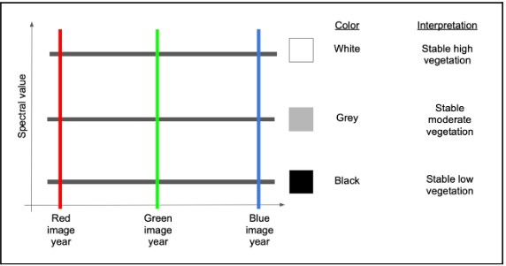

If we have a disturbance between the Green and Blue years, that means the index will be high in both Red and Green colors, but low in blue. Following additive color theory (see [https://en.wikipedia.org/wiki/Additive_color](https://en.wikipedia.org/wiki/Additive_color)), this would result in a yellow color.

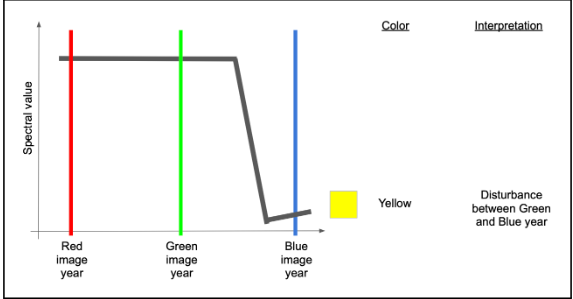

If, on the other hand, the disturbance occurred before the green year and did not see much recovery by the blue year, we would have high values mostly in red.

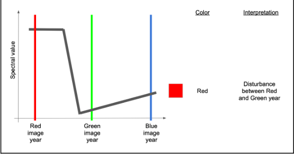

If there were recovery by the time of the blue year, then there would be high red and blue, making some shade of purple or magenta.

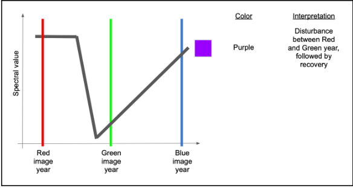

A couple of other variants are commonly seen and worth learning.
If an area sees consistent growth in vegetation across all years, it will have relatively low red, slightly higher green, and highest blue, making some form of cyan to blue.

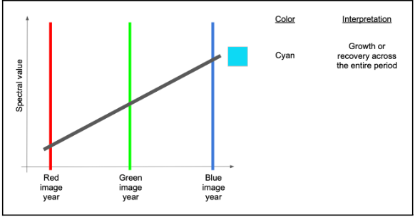

Finally, if there is persistent decline over the full time period, red will be highest, followed by green and then blue -- making some version of brown or orange.

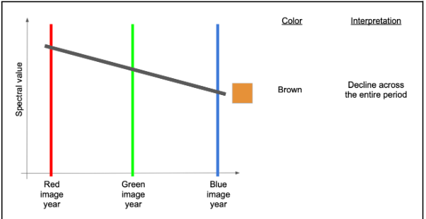

**(OPTIONAL) Use pixel-level plotter with RGB images to interpret colors**

Those color rules can be somewhat abstract until you see them in action. The LandTrendr GUI gives us the chance to do that: use the RGB color map to select pixels and plot them in the pixel-level mode!
First, double check that your RGB image has loaded into the map view.
Then, on the Control menu on the left, re-select the "Pixel Time Series Options" menu.

Now, you can click around in the RGB image to see what pixels look like in different areas of the image.
For example you may see an area where there is a fair amount of purple "striping". The following image is an example displaying NBR indice charts.

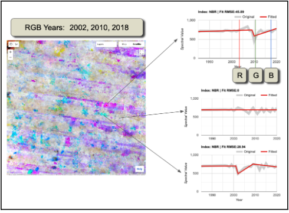

Interpretation: We use the RGB viewer combined with the pixel-plotter to assess both spatial and temporal patterns. Examining only the top and bottom spectral trajectories, the source imagery appears to show drops in spectral value that are persistent over more than one year and may appear to be real. However, with the RGB viewer, we can see that the spatial pattern is disjunct with the underlying landscape (not shown in the figure above, but it is forested). Moreover, the pattern of disturbance appears to be horizontal and linear.

The spatial pattern of these artifacts is suggestive of the Landsat 7 scan line error pattern -- a problem where roughly-horizontal slices of the Landsat 7 imagery are not recorded.

Note! The problem is not, in fact, with the Landsat 7 images, but the fact that they have no data in these areas and are allowing an underlying Landsat 8 or Landsat 5 image with cloud problems to show through!

Nevertheless, the summary interpretation here is that this region has persistent cloudiness that is not being captured by the default cloud mask algorithms.
What is the solution? The key thing to realize here is that the persistent cloudiness is happening within the window of the season that we are using to build the image collections! Thus, the best option is to examine and change the window of time for the image collections. 

Next, look for areas that have red and yellow patterns -- those should be disturbance.
Here's one example:

The spatial patterns of the red and yellow areas are consistent with the underlying landscape pattern, lending credibility to the detection of actual change. Moreover, the source data in the pixel trajectories, while noisy, appear to be consistent with the signal of disturbance.

However, we also see an example of a purple disturbance with an odd spatial pattern (lower right figure). Hovering over the chart itself and examining the grey source data, one can inspect which years of data are actually present. In doing so, it emerges that many years of source data are missing. This occurs when clouds are present.

**Setting the Parameters in the GUI**

1. You can update the input parameters for the algorithm by expanding the "LandTrendr Options" menu of the GUI. A basic video showing this process is here: [https://youtu.be/TNQOdHIg24s](https://youtu.be/TNQOdHIg24s). Many of the values have been pre-set to work for Nepal, but you can adjust them. For example, after experimentation, TCW (Tasseled Cap Wetness) was found to be an indice that works well in Nepal’s environments. The date range choice is one of the more important choices in the LandTrendr implementation process. The user must balance the goal of using images in times of year when clear observations are most likely against the goal of finding the change of interest. Full parameters description are here: [https://github.com/wespestad/MRV/blob/9380035aff6fd7b65dc8b28bb28ae3e9f4deff3d/Modules_2/change_detection_landtrendr_v3.md#353-exploring-impacts-of-the-fitting-parameters](https://github.com/wespestad/MRV/blob/9380035aff6fd7b65dc8b28bb28ae3e9f4deff3d/Modules_2/change_detection_landtrendr_v3.md#353-exploring-impacts-of-the-fitting-parameters))

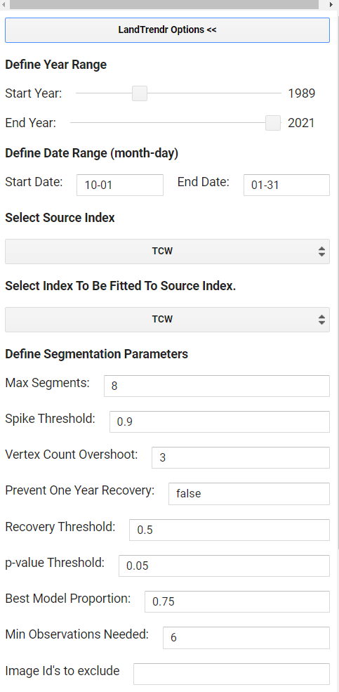

*Max Segments*: Set to 8. With about 30 possible years of data, eight segments is still appropriate, as it is well under the 3:1 ratio rule of thumb

*Spike Threshold*: Keep at 0.9. This parameter can have some effect when there are noisy trajectories, but it may not need to be changed until after we view the impacts of changing the date range. Setting it to 1.0 allows all spikes to be kept, while lower values remove some sharp features that may be noise.

*Vertex Count Overshoot*: Keep at 3. This parameter rarely needs to change.

*Prevent One Year Recovery*: Set to "false". This is an aggressive parameter that does what it suggests -- it prevents one-year recovery segments. However it is more generally useful to tune the recovery using the next parameter -- the Recovery threshold.

*Recovery Threshold*: Set to 0.5. Lower numbers disallow very quick recoveries, but in tropical regions quick vegetative recovery after disturbance is the norm. 0.5 is a moderate value and dampens the impacts of noise. A value of 1 would allow all details in the recovery pattern to be seen, but can also lead to overfitting of noise and artifacts.

*p-value Threshold*: Keep at 0.05. However, if we note that the fits are not tracking somewhat noisy source data, this value could  be relaxed to 0.15.Increasing the p-value threshold allows fits to be captured that retain more residual noise after fitting. For Nepal, 0.05 was chosen after iterative testing.

*Best model Proportion*: Keep at 0.75

*Min Observations needed*: Keep at 6.

*Image Id’s to exclude*: Leave blank unless you completed the optional High-Quality Landsaty Image selector tool.

2. In the Asset Overlay section, put the path to your AOI in the first blank. Then check the box at the end to use it for the AOI in your analysis. Click the ‘Add Asset to Map’ button.

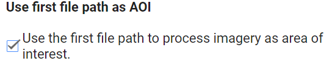

3. The RGB Change Options section will be used later to calculate changes over time. The value for Red should be your first year of your time period of interest, Blue your last year, and Green somewhere in between. Click the Add RGB imagery button to see the results. This may take a while to load or may fail to visualize if you have a very large study area.

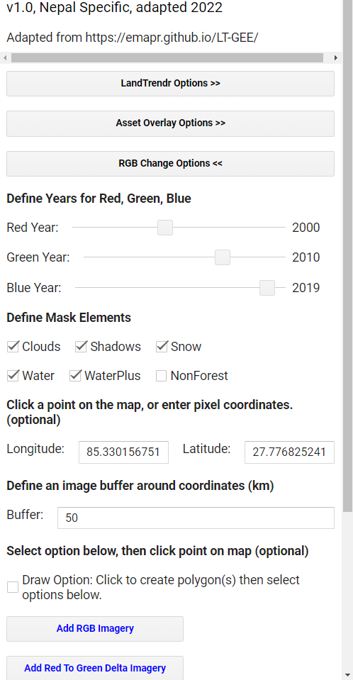

4. The Pixel Time Series options sections of the tool are optional. It is a quick way to visualize changes and the effects of your chosen parameters, but is not needed for the change analysis.

5. The Change Filter Options and Download Options sections you will run twice, once to map forest loss and then forest gain. Set the parameters like the screenshot below. 
    * Make sure “Loss” and “Greatest” are selected. Have the “Filter by Year'' checked and adjust the time period if needed to include the full time you analyzed. All other options should remain not checked. You will complete this post processing in the next script. Adjust the years to your time period of interest, not the longer time period used to train the model.

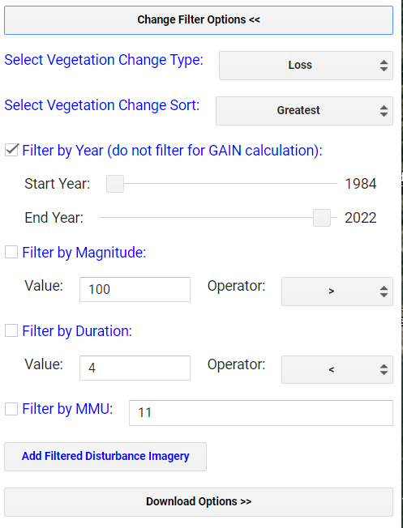

6. Set the ESPG to 4326 for WGS 84 and set your output file name. 

7. Download the automatically selected files. The others are optional.

8. Download all the resulting files from the Tasks tab to your GEE assets to be used in the next script. There will be 6 files to download, those ending with: RGB-year-year-year, DSNR, MAG, DUR, PREVAL, YOD.

9. Repeat steps 5, 6, and 7 with the minor changes explained below.
    * This time use “Gain” instead of “Loss” and change “Greatest” to “Newest”. 
    * Uncheck the Filter by Year option.
    * Name the exports so you can tell they are the “Gain” version. 
    * The RGB-year-year-year and DSNR files are the same as before so for your gain run you only need to download the files ending with: MAG, DUR, PREVAL, YOD.

