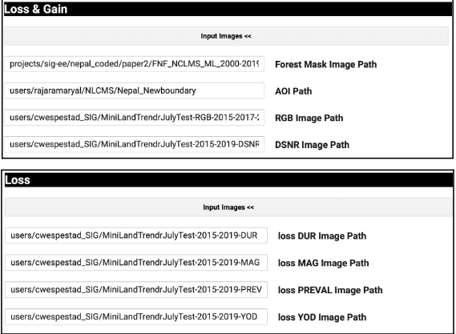
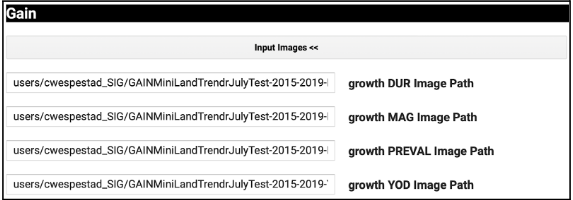
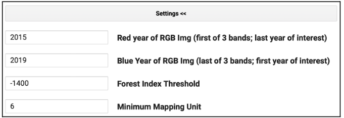
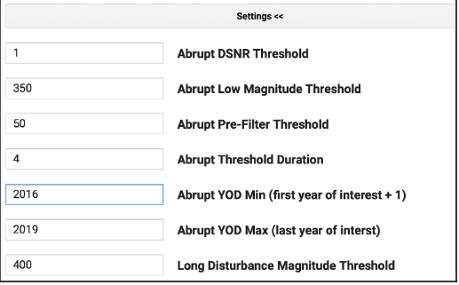
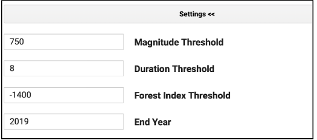
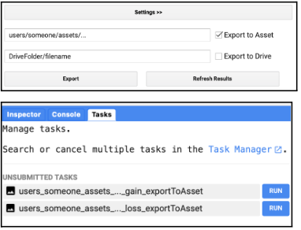
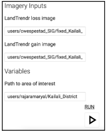
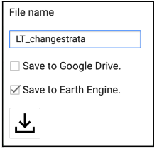

# Post-process the LandTrendr Loss and Gain Maps

This workflow computes Loss (degradation & deforestation) and Gain (forest growth) independently of one another. Use your LandTrendr Gain Run outputs to calculate a Growth image and your Landtrendr Loss Run outputs to calculate a Loss Image. If you choose not to map Reforestation you will only need the Loss Image that is generated in this tool.

1. Find and open the script named: **3_LTMakeLossGainPostprocessed**. Click “Run” at the top to start the GUI.
2. Input the paths to all the output files you created in the last tool under the dropdown menus for Loss & Gain, Loss, and Gain. These exports will need to be completed before you can run this tool.

3. The post-processing settings should not be adjusted without careful consideration and iterative testing. Leave the defaults as-is, except the years.    
    * Under the setting used for both loss and gain:
        * The Red Year should be the first year of interest.
        * The Blue Year should be the final year of interest.

4. Under the settings used for loss:
    * YOD Min should be the initial year of your analysis plus 1 (e.g. if analyzing 2015-2019, put 2016 here).
    * Abrupt YOD Max should be your last year of interest.

5. Under the settings used for gain:
    * The End Year should be your final year of interest.

6. Fill in a file name for the export asset. Only selecting the “Export to Asset” option is required, while the “Export to Drive” is optional. For whatever asset path and name you chose, the words “gain_exporttoAsset” and “loss_exporttoAsset” will be appended to the end. When you click the Export button, assets for both loss and gain will appear under the tasks tab (unless you did not input images for one of them). Click “Run” under the Tasks tab to export each asset. 

**Assemble the Loss and Gain Maps into One Map**

Combining the post-processed Loss and Gain maps will produce one map of all changes detected by LandTrendr. Gain will be relabeled with a strata value of 5. If degradation and gain occur in the same pixel, it will be relabeled as degradation. Reforestation will also replace any pixels labeled as having no forest change in the Loss map. Loss and Gain pixels should not co-occur.

1. Find and open the script named: 4_AssembleMap. Click “Run” at the top to start the GUI.

2. Input the paths to your post-processed loss and gain assets in GEE. They must have finished exporting to run this script. 

3. Input the path to your AOI. It currently defaults to a study area for Kailali. Then click the Run button.

4. Your assembled LandTrendr change strata map will appear in the Map window.

5. Export your results. Only the GEE asset option is required to continue the analysis.

6. Finish exporting your asset under the Tasks tab.

